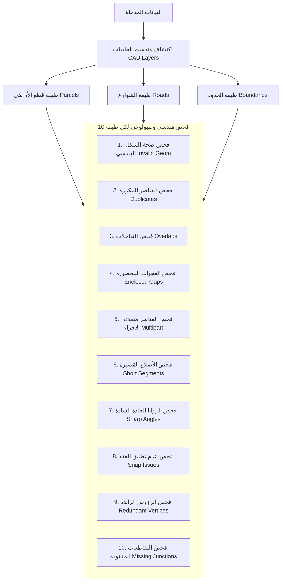

# CAD Standards & Layer QC Analyzer — Comprehensive Guide
# الدليل الشامل لأداة فحص ومطابقة معايير الكاد وضبط الجودة الطبولوجية

> **Production-Ready ArcGIS Pro Python Toolbox (`.pyt`)**  
> **أداة متقدمة متوافقة بالكامل مع ArcGIS Pro لفحص وتدقيق مخططات الكاد (CAD) ومطابقتها للمعايير والتحقق الطبولوجي والهندسي.**

---

## Table of Contents / الفهرس

- [العربية (Arabic Guide)](#-الدليل-باللغة-العربية)
  - [1. مقدمة وفلسفة الأداة](#1-مقدمة-وفلسفة-الأداة)
  - [2. المميزات الرئيسية](#2-المميزات-الرئيسية)
  - [3. شرح الأدوات بالتفصيل](#3-شرح-الأدوات-بالتفصيل)
    - [الأداة الأولى: مطابقة الكاد المرجعي (CAD Reference Comparison QC)](#الأداة-الأولى-فحص-ومطابقة-الكاد-المرجعي-cad-reference-comparison-qc)
    - [الأداة الثانية: فحص الجودة الهندسية والطبولوجية (Geometry & Topology QC Analyzer)](#الأداة-الثانية-فحص-الجودة-الهندسية-والطبولوجية-geometry--topology-qc-analyzer)
  - [4. الفحوصات الهندسية والطبولوجية العشرة (10 Checks)](#4-الفحوصات-الهندسية-والطبولوجية-العشرة-10-checks)
  - [5. الفحص التلقائي لكل طبقة (Per-Layer QC)](#5-الفحص-التلقائي-لكل-طبقة-per-layer-qc)
  - [6. قواعد التعامل مع الطبقة 0 (Layer '0' Standards)](#6-قواعد-التعامل-مع-الطبقة-0-layer-0-standards)
  - [7. التقارير والمخرجات](#7-التقارير-والمخرجات)
  - [8. دليل الاستخدام خطوة بخطوة في ArcGIS Pro](#8-دليل-الاستخدام-خطوة-بخطوة-في-arcgis-pro)
- [English Guide](#-english-guide)
  - [1. Overview & Core Philosophy](#1-overview--core-philosophy)
  - [2. Key Capabilities](#2-key-capabilities)
  - [3. Detailed Tool Specifications](#3-detailed-tool-specifications)
    - [Tool 1: CAD Reference-Based Comparison QC](#tool-1-cad-reference-based-comparison-qc)
    - [Tool 2: Geometry & Topology QC Analyzer](#tool-2-geometry--topology-qc-analyzer)
  - [4. The 10 Geometry & Topology Checks](#4-the-10-geometry--topology-checks)
  - [5. Automatic Per-Layer Processing](#5-automatic-per-layer-processing)
  - [6. Reserved CAD Layer '0' Standards & Rules](#6-reserved-cad-layer-0-standards--rules)
  - [7. Deliverables & Reports](#7-deliverables--reports)
  - [8. Step-by-Step Tutorial for ArcGIS Pro](#8-step-by-step-tutorial-for-arcgis-pro)
- [Project Architecture / الهيكل البرمجي للمشروع](#-project-architecture--الهيكل-البرمجي-للمشروع)

---

# 🇸🇦 الدليل باللغة العربية

---

## 1. مقدمة وفلسفة الأداة

في مشاريع التخطيط العمراني، والمسح الجغرافي، واعتماد المخططات الهندسية، تمثل عملية مراجعة ملفات الكاد الواردة (Received CAD) ومطابقتها للمخططات المعتمدة (Approved/Reference CAD) تحدياً كبيراً يتطلب ساعات طويلة من التدقيق اليدوي المعرض للخطأ.

تم بناء هذه الأداة كـ **ArcGIS Pro Python Toolbox (`.pyt`)** لتوفر حلاً متكاملاً يجيب على سؤالين أساسيين:
1. **ما الذي تغير بين المخطط المعتمد والمخطط المستلم؟**  
   (هل أضيفت طبقات جديدة؟ هل حذفت طبقات؟ هل تغيرت أنواع العناصر الهندسية كتحويل المضلعات إلى خطوط مفتوحة؟ هل تغيرت الألوان أو سماكات الخطوط؟).
2. **ما هي العيوب الهندسية والطبولوجية الموجودة داخل البيانات نفسها؟**  
   (تداخلات، تكرارات، زوايا حادة شاذة، عدم تطابق العقد، فجوات، أجزاء متناهية الصغر، أخطاء الإغلاق).

### فلسفة عدم الاعتماد على قواعد ثابتة (Dynamic Standard Learning)
الأداة **لا تفرض أي قواعد مسبقة أو شروط صلبة مبرمجة كودياً**. بدلاً من ذلك، تقوم الأداة بقراءة وفحص المخطط المرجعي المعتمد (Reference CAD) ديناميكياً، وتتعلم منه المعيار المقبول لكل طبقة:
- ما هو نوع الهندسة السائد؟ (Dominant Geometry Type)
- هل الطبقة تتطلب إغلاقاً هندسياً (Closed Polylines / Polygons)؟
- ما هي الألوان وسماكات وأنواع الخطوط المعتمدة لكل طبقة؟  
ثم تطبق ما تعلمته بدقة 100% على المخطط المستلم.

---

## 2. المميزات الرئيسية

- **أداة قراءة فقط 100% (Strictly Read-Only)**: لا تعدل ولا تحذف ولا تغير أياً من البيانات المصدرية إطلاقاً.
- **دعم كامل لملفات الأوتوكاد مباشرة (`.dwg`, `.dxf`)**: تدعم اختيار ملف الكاد بالكامل كـ `CAD Drawing Dataset` أو اختيار الـ Feature Classes الداخلية (`Polyline`, `Polygon`, `Point`...).
- **فحص هندسي وطبولوجي تلقائي لكل طبقة (Per-Layer Automation)**: تقوم الأداة تلقائياً بتقسيم العناصر حسب حقل الـ `Layer` وفحص كل طبقة كاد بشكل مستقل لمنع التداخلات والنتائج الخاطئة بين الطبقات المختلفة (مثل الشوارع مع قطع الأراضي).
- **محرك فهارس مكانية سريع في الذاكرة ($O(N \log N)$)**: استخدام شبكة مكانية (Spatial Grid) وفهرسة إحداثيات الرؤوس (Vertex Hash Indexing) لإجراء الفحوصات الطبولوجية بسرعة فائقة دون استهلاك لموارد الجهاز.
- **تنوع المخرجات والتقارير الاحترافية**:
  - تقرير إكسل تفصيلي مرمز بالألوان (`.xlsx`) متعدد الصفحات.
  - لوحة تحكم تفاعلية احترافية بتنسيق ويب (`.html`) تدعم الفلترة.
  - ملخص نصي سريع (`.txt`).
  - طبقة مكانية بالعيوب (`Feature Class`) تُسقط مكان كل خطأ بإحداثياته الدقيقة لعرضه في ArcGIS Pro.

---

## 3. شرح الأدوات بالتفصيل

يحتوي التول بوكس على أداتين رئيسيتين:

---

### الأداة الأولى: فحص ومطابقة الكاد المرجعي (`CADReferenceComparisonQCTool`)
**الهدف**: المقارنة الشاملة بين مخطط معتمد (Reference) ومخطط مستلم (Received).

#### معاملات الإدخال (Parameters):
| الباراميتر (Parameter) | النوع (Type) | الحالة | القيمة الافتراضية | الشرح |
| :--- | :--- | :--- | :--- | :--- |
| **Reference CAD / Approved Dataset** | Feature Layer / Class / CAD Drawing | إجباري | — | المخطط المرجعي المعتمد (الأساس). |
| **Reference Layer Field** | Field | اختياري | `Layer` | حقل اسم الطبقة (يتم اكتشافه تلقائياً). |
| **Received CAD / Client Dataset** | Feature Layer / Class / CAD Drawing | إجباري | — | المخطط المستلم من العميل أو المكتب الهندسي. |
| **Received Layer Field** | Field | اختياري | `Layer` | حقل اسم الطبقة للمخطط المستلم. |
| **Comparison Scope** | String | اختياري | `All Layers` | نطاق الفحص: جميع الطبقات أو الطبقات المغلقة فقط. |
| **Dominant Geometry Threshold** | Double | اختياري | `0.50` (50%) | نسبة اعتبار نوع الهندسة هو السائد في الطبقة. |
| **Closure Tolerance** | Double | اختياري | `0.01` (1 سم) | أقصى مسافة مقبولة بين نقطة البداية والنهاية لاعتبار الخط مغلقاً. |
| **Output Folder for Reports** | Folder | إجباري | — | المجلد الذي ستُحفظ فيه التقارير الناتجة. |
| **Compare Feature Counts** | Boolean | اختياري | `True` | مقارنة أعداد العناصر واكتشاف النقص أو الزيادة. |
| **Compare Geometries** | Boolean | اختياري | `True` | التحقق من تطابق أنواع العناصر واكتشاف العناصر الدخيلة. |
| **Compare Closure** | Boolean | اختياري | `True` | فحص إغلاق الخطوط ومقارنتها بنسبة الإغلاق في الأصل. |
| **Compare Colors / Lineweights / Types** | Boolean | اختياري | `True` | مقارنة خصائص الكاد (الألوان، السماكات، أنواع الخطوط). |
| **Case-Sensitive Layer Names** | Boolean | اختياري | `False` | حساسية حالة الأحرف في أسماء الطبقات (بالإنجليزية). |
| **Trim Layer Name Whitespace** | Boolean | اختياري | `True` | حذف المسافات الزائدة من بداية ونهاية اسم الطبقة. |
| **Run Geometry QC on Received CAD** | Boolean | اختياري | `False` | تشغيل الفحص الهندسي والطبولوجي الشامل على المخطط المستلم ضمن نفس العملية. |
| **Generate Excel / HTML / Text Reports** | Boolean | اختياري | `True` | توليد التقارير المتنوعة. |
| **Output Issue Feature Class** | Feature Class | اختياري | — | مسار حفظ طبقة النقاط الجغرافية التي تمثل الأخطاء. |

---

### الأداة الثانية: فحص الجودة الهندسية والطبولوجية (`GeometryQCTool`)
**الهدف**: فحص أي طبقة كاد أو طبقة جغرافية (GIS) والتحقق من سلامتها الهندسية والطبولوجية وخلوها من العيوب والأخطاء.

#### معاملات الإدخال (Parameters):
| الباراميتر (Parameter) | النوع (Type) | الحالة | القيمة الافتراضية | الشرح |
| :--- | :--- | :--- | :--- | :--- |
| **Input Feature Class / CAD Drawing** | Feature Layer / Class / CAD Drawing | إجباري | — | ملف الكاد أو الطبقة المراد فحصها. |
| **CAD Layer Field (Optional)** | Field | اختياري | `Layer` | حقل اسم الطبقة (يكتشفه النظام تلقائياً). |
| **Target CAD Layer** | String (Dropdown) | اختياري | `All Layers` | اختيار فحص طبقة محددة أو فحص جميع الطبقات تلقائياً. |
| **Layer Display Name / Label** | String | اختياري | `GeometryQC` | تسمية تعريفية للتقرير. |
| **Short Segment Threshold (meters)** | Double | اختياري | `0.10` م (10 سم) | أقل طول مسموح به لأي ضلع. |
| **Sharp Angle Threshold (degrees)** | Double | اختياري | `5.0°` درجات | أصغر زاوية مسموح بها لاكتشاف البروزات الحادة الشاذة. |
| **Snap Issue Threshold (meters)** | Double | اختياري | `0.01` م (1 سم) | مسافة الكشف عن العقد القريبة غير المتطابقة (Undershoot/Overshoot). |
| **Redundant Vertex Angle (degrees)** | Double | اختياري | `179.9°` درجة | كشف الرؤوس الزائدة المتتالية على خط مستقيم. |
| **Missing Junction Threshold (meters)** | Double | اختياري | `0.01` م (1 سم) | كشف تقاطعات العقد المفقودة (T-Junctions). |
| **Overlap Area Tolerance (m²)** | Double | اختياري | `0.0001` م² | الحد الأدنى لمساحة التداخل المعتبرة كخطأ. |
| **Enclosed Gap Area Tolerance (m²)** | Double | اختياري | `0.001` م² | الحد الأقصى لمساحة الفجوات الضيقة المحصورة بين المضلعات. |
| **Output Folder for Reports** | Folder | إجباري | — | مجلد حفظ التقارير. |
| **Check Toggles (10 Checks)** | Boolean | اختياري | `True` (الكل) | إمكانية تفعيل أو تعطيل أي من الفحوصات العشرة بشكل مستقل. |
| **Generate Excel / HTML / Text Reports** | Boolean | اختياري | `True` | خيارات استخراج التقارير. |
| **Output Issue Feature Class** | Feature Class | اختياري | — | مسار حفظ طبقة النقاط للأخطاء المكتشفة. |

---

## 4. الفحوصات الهندسية والطبولوجية العشرة (10 Checks)

تقوم الأداة بتنفيذ عشرة فحوصات متقدمة ومطابقة لأعلى معايير الـ GIS والمساحة:



1. **فحص صحة الهندسة (`CHK_INVALID_GEOM` - Invalid Geometry)**:
   - يكتشف الأشكال المشوهة، التقاطع الذاتي لنفس المضلع (Self-intersection)، الأشكال التي تشبه ربطة القوس (Bow-tie)، والإحداثيات الشاذة (NaN).
   - **مستوى الخطورة**: `ERROR`.

2. **فحص العناصر المتطابقة والمكررة (`CHK_DUPLICATE` - Duplicate Geometry)**:
   - يكتشف وجود عنصرين أو أكثر بنفس الإحداثيات والمساحة بدقة تطابق $\ge 99.9\%$.
   - **مستوى الخطورة**: `ERROR`.

3. **فحص التداخلات بين المضلعات (`CHK_OVERLAP` - Polygon Overlaps)**:
   - يكتشف ركوب مضلع فوق مضلع مجاور وحساب مساحة التداخل بدقة بالغة مع استبعاد العناصر المكررة لمنع الازدواجية في التقارير.
   - **مستوى الخطورة**: `ERROR`.

4. **فحص الفجوات المحصورة (`CHK_GAP` - Enclosed Gaps / Slivers)**:
   - يكتشف الفراغات والجيوب الصغيرة المحصورة وغير المقصودة بين حدود المضلعات المجاورة.
   - **مستوى الخطورة**: `ERROR`.

5. **فحص العناصر متعددة الأجزاء (`CHK_MULTIPART` - Multipart Features)**:
   - يكتشف السجلات التي تحتوي على أكثر من جزء منفصل في حين يجب أن تمثل كل قطعة أرض عنصراً مستقلاً (Singlepart).
   - **مستوى الخطورة**: `WARNING`.

6. **فحص الأضلاع شديدة القصر (`CHK_SHORT_SEG` - Short Segments)**:
   - يكتشف الأضلاع الميكروسكوبية الناتجة عن أخطاء الرسم أو التحويل والتي يقل طولها عن الحد المسموح (مثلاً أقل من 10 سم).
   - **مستوى الخطورة**: `WARNING`.

7. **فحص الزوايا الحادة الشاذة (`CHK_ANGLE` - Sharp Angles / Spikes)**:
   - يكتشف الزوايا الحادة جداً (مثلاً أصغر من 5 درجات) الناتجة عن ارتداد خط الرسم (Needle spikes) والتي تشوه الشكل الهندسي.
   - **مستوى الخطورة**: `WARNING`.

8. **فحص عدم تطابق العقد القريبة (`CHK_SNAP` - Snap Issues)**:
   - يكتشف أطراف الخطوط أو الرؤوس القريبة جداً من بعضها دون أن تلتقي، مثل عدم وصول الخط لنهايته (Undershoot) أو تجاوزه للحد بمسافة ضئيلة (Overshoot).
   - **مستوى الخطورة**: `ERROR`.

9. **فحص الرؤوس الزائدة المتتالية (`CHK_REDUNDANT` - Redundant Vertices)**:
   - يكتشف النقاط الإضافية غير الضرورية الواقعة على استقامة واحدة مع الضلع (زاوية تقترب من 180 درجة) مما يثقل حجم الملف بلا فائدة.
   - **مستوى الخطورة**: `WARNING`.

10. **فحص التقاطعات والعقد المفقودة (`CHK_JUNCTION` - Missing Junctions / T-Intersections)**:
    - يكتشف عندما يلمس طرف خط ضلع خط مجاور دون وجود عقدة مشتركة (Node/Vertex) تقسم الضلع في نقطة التقاطع.
    - **مستوى الخطورة**: `ERROR`.

---

## 5. الفحص التلقائي لكل طبقة (Per-Layer QC)

الميزة الأهم والمطورة خصيصاً لتناسب ملفات الكاد:
- في ملفات الكاد، تحتوي طبقة البولي لاين أو البوليجون على مئات العناصر التابعة لطبقات وظيفية مختلفة (مثل: `parcel`, `roud`, `setback`, `boundary`).
- **المشكلة السابقة**: دمج هذه العناصر وفحصها معاً يتسبب في احتساب تداخل الشارع مع قطعة الأرض كخطأ، أو احتساب تقاطع الرصيف مع الحد كخطأ!
- **الحل الذكي في هذه الأداة**:
  1. الأداة تقرأ ملف الكاد أو الطبقة، وتكتشف جميع الطبقات تلقائياً.
  2. تقوم بعزل عناصر كل طبقة في مجموعة مستقلة.
  3. تنفذ الفحوصات العشرة على عناصر كل طبقة بمعزل عن الطبقات الأخرى.
  4. في التقرير النهائي، تظهر قائمة واضحة ومحددة:
     - **طبقة `parcel`**: 6 أخطاء (2 تداخل، 1 تكرار، 3 عدم إغلاق).
     - **طبقة `roud`**: خالية تماماً من الأخطاء (Passed).

---

## 6. قواعد التعامل مع الطبقة 0 (Layer '0' Standards)

طبقة **`0`** (وكذلك طبقة `Defpoints`) في الأوتوكاد هي طبقات نظام محجوزة (Reserved System Layers):
- **المعيار الهندسي والمساحي الصارم**: يجب **ألا تحتوي الطبقة `0` على أي عناصر أو أشكال مرسومة إطلاقاً**، حيث أنها مخصصة لإنشاء الرموز والبلوكات فقط (Blocks) ولا يجوز تسليم مخططات تحتوي على عناصر في الطبقة `0`.
- **طريقة تعامل الأداة الذكية مع الطبقة `0`**:
  1. **في المخطط المرجعي (Reference CAD)**: حتى لو كان المخطط المرجعي المعتمد يحتوي على بيانات في الطبقة `0`، تطلق الأداة تحذيراً (`WARNING` - `CHK_RESERVED_LAYER`) في التقرير يوضح أن المخطط المرجعي يخالف المعايير باحتوائه على عناصر في الطبقة `0`.
  2. **في المخطط المستلم (Received CAD)**: إذا وجد في الطبقة `0` أي عنصر، تظهر الأداة تحذيراً صريحاً وتدرج ذلك في تقرير الإكسل والـ HTML ولوحة الـ Geoprocessing.
  3. **في حالة تصحيح المخطط المستلم**: إذا كان المخطط المرجعي يحتوي على بيانات في الطبقة `0`، لكن العميل قام بحذفها أو تنظيفها في المخطط المستلم، **لا تعتبر الأداة ذلك خطأ نقص طبقات (`MISSING_LAYER`)**، بل تعتبره امتثالاً ممتازاً لمعايير الكاد وتصحيحاً مطلوباً.

---

## 7. التقارير والمخرجات

توفر الأداة منظومة تقارير متكاملة فور انتهاء الفحص:

### 1. تقرير إكسل التفاعلي (`.xlsx`)
مبني بواسطة مكتبة `openpyxl` ومصمم بألوان عصرية:
- **Summary**: ملخص تنفيذي يوضح إجمالي الطبقات، نسبة النجاح، عدد الأخطاء الكلي.
- **Reference Profile**: المعايير المستفادة من الكاد الأصلي.
- **Layer Overview**: جدول مقارنة شامل للطبقات بحالات متباينة (`PASS`, `ERROR`, `WARNING`, `MISSING`, `EXTRA`).
- **Geometry QC Summary**: جدول الفحوصات العشرة وجدول **تفصيل الأخطاء لكل طبقة كاد**.
- **Geometry QC Issues**: جدول بجميع الأخطاء موضحاً فيه اسم الطبقة، رقم العنصر (OID)، نوع الخطأ، والإحداثيات.

### 2. لوحة التحكم التفاعلية (`.html`)
- ملف HTML ذاتي التشغيل (Standalone) لا يحتاج إلى إنترنت.
- يحتوي على بطاقات مؤشرات الأداء (KPI Cards).
- أزرار فلترة سريعة لعرض الطبقات الناجحة أو التي بها أخطاء.
- جدول خاص بأخطاء كل طبقة كاد مع شارات ملونة (Badges).

### 3. تقرير نصي سريع (`.txt`)
- ملف نصي خفيف ومثالي للمراجعة السريعة أو الأرشفة في السجلات.

### 4. طبقة الأخطاء الجغرافية (`Issue Feature Class`)
- تُنشئ الأداة طبقة نقاط جغرافية تسقط في مساحة العمل (Geodatabase أو Shapefile).
- يستطيع المستخدم فتحها في خريطة ArcGIS Pro ليرى كل خطأ مكانه على المخطط والرمز الخاص به ونوعه للتعديل الفوري.

---

## 8. دليل الاستخدام خطوة بخطوة في ArcGIS Pro

1. افتح مشروعك في **ArcGIS Pro**.
2. من لوحة **Catalog**:
   - اضغط بزر الفأرة الأيمن على مجلد **Toolboxes** واختر **Add Toolbox**.
   - اختر الملف `CAD_QC_Toolbox.pyt`.
3. لتشغيل **مقارنة الكاد المرجعي**:
   - انقر نقراً مزدوجاً على أداة `CAD Reference-Based Comparison QC`.
   - اختر ملف الكاد المعتمد في `Reference CAD`.
   - اختر ملف الكاد المستلم في `Received CAD`.
   - حدد مجلد المخرجات `Output Folder for Reports` ثم اضغط **Run**.
4. لتشغيل **الفحص الهندسي والطبولوجي الشامل**:
   - انقر نقراً مزدوجاً على أداة `Geometry & Topology QC Analyzer`.
   - اختر ملف الكاد (مثل `edited.dwg`) أو أي طبقة مرسومة.
   - اختر `Target CAD Layer` (اتركها `All Layers` لفحص جميع الطبقات تلقائياً أو اختر طبقة معينة).
   - حدد مجلد حفظ التقارير واضغط **Run**.
5. بمجرد انتهاء الفحص، ستظهر لك رسائل تفصيلية في لوحة الـ Geoprocessing توضح حالة كل طبقة، وتجد ملفات التقارير جاهزة داخل مجلد المخرجات.

---

# 🇬🇧 English Guide

---

## 1. Overview & Core Philosophy

In civil engineering, urban planning, and cadastre management, reviewing CAD deliverables submitted by contractors or consultants is traditionally a tedious, error-prone manual task.

The **CAD Standards & Layer QC Toolbox** is a production-grade **ArcGIS Pro Python Toolbox (`.pyt`)** designed to answer two fundamental Quality Control questions:
1. **Reference-Based CAD Comparison**:  
   *"What changed between the approved Original CAD and the Received/Client CAD submission?"*  
   Detects missing/extra layers, feature count deltas, geometry mix shifts, polyline closure regressions, and CAD property variations (colors, lineweights, linetypes).
2. **Geometry & Topology QC**:  
   *"What geometric and topological defects exist inside the data itself?"*  
   Identifies overlaps, duplicates, sliver gaps, sharp spikes, snap issues, missing junctions, redundant vertices, and invalid shapes.

### Dynamic Standard Learning (Zero Hardcoding)
The engine does **not** rely on rigid, hardcoded configuration files. Instead, it inspects the authoritative Reference CAD dynamically:
- Discovers the baseline layer standard.
- Learns the dominant geometry type and polyline closure rate.
- Learns color, lineweight, and linetype profiles.  
It then holds the Received CAD to the exact standards learned from the reference drawing.

---

## 2. Key Capabilities

- **100% Read-Only Safety**: Inspects and queries data using non-destructive search cursors. Source files are never modified.
- **Native AutoCAD `.dwg` and `.dxf` Support**: Seamlessly processes both complete CAD drawing datasets (`DECADDrawingDataset`) and discrete feature layers.
- **Automatic Per-Layer Geometry QC**: Partitions features by their native CAD `Layer` attribute field, running topology and geometry checks strictly within each CAD layer.
- **High-Performance Spatial Indexing ($O(N \log N)$)**: In-memory 2D spatial grid index and coordinate hash hashing for near-instant execution on large municipal plans.
- **Multi-Format Professional Deliverables**:
  - Multi-sheet styled Excel workbook (`.xlsx`) via `openpyxl`.
  - Responsive standalone HTML dashboard (`.html`).
  - Concise ASCII summary log (`.txt`).
  - GIS Point Feature Class mapping issue locations for direct inspection in ArcGIS Pro.

---

## 3. Detailed Tool Specifications

---

### Tool 1: CAD Reference-Based Comparison QC (`CADReferenceComparisonQCTool`)

#### Parameter Reference:
| Parameter | Type | Direction | Default | Description |
| :--- | :--- | :--- | :--- | :--- |
| **Reference CAD / Approved Dataset** | Feature Layer / Class / CAD Drawing | Input | *Required* | Authoritative approved CAD dataset. |
| **Reference Layer Field** | Field | Input | `Layer` (auto) | Attribute field containing CAD layer names. |
| **Received CAD / Client Dataset** | Feature Layer / Class / CAD Drawing | Input | *Required* | Submitted CAD dataset to be validated. |
| **Received Layer Field** | Field | Input | `Layer` (auto) | Attribute field containing CAD layer names. |
| **Comparison Scope** | GPString | Input | `All Layers` | Scope: All Layers or closed-geometry layers. |
| **Dominant Geometry Threshold** | GPDouble | Input | `0.50` (50%) | Threshold ratio for dominant geometry assignment. |
| **Closure Tolerance** | GPDouble | Input | `0.01` (1 cm) | Maximum endpoint distance to qualify as closed polyline. |
| **Output Folder for Reports** | DEFolder | Input | *Required* | Directory where reports are saved. |
| **Compare Feature Counts** | GPBoolean | Input | `True` | Flags count discrepancies. |
| **Compare Geometries** | GPBoolean | Input | `True` | Detects unexpected entity types & geometry distribution changes. |
| **Compare Closure** | GPBoolean | Input | `True` | Flags unclosed polylines where closed polylines were expected. |
| **Compare Colors / Lineweights / Types** | GPBoolean | Input | `True` | Analyzes CAD property distributions. |
| **Case-Sensitive Layer Names** | GPBoolean | Input | `False` | Toggles case sensitivity for layer names. |
| **Trim Layer Name Whitespace** | GPBoolean | Input | `True` | Strips leading/trailing spaces from layer names. |
| **Run Geometry QC on Received CAD** | GPBoolean | Input | `False` | Mode C: executes 10-check geometry suite on Received CAD. |
| **Generate Excel / HTML / Text Reports** | GPBoolean | Input | `True` | Generates formatted deliverables. |
| **Output Issue Feature Class** | DEFeatureClass | Output | *Optional* | Path to write spatial point issues. |

---

### Tool 2: Geometry & Topology QC Analyzer (`GeometryQCTool`)

#### Parameter Reference:
| Parameter | Type | Direction | Default | Description |
| :--- | :--- | :--- | :--- | :--- |
| **Input Feature Class / CAD Drawing** | Feature Layer / Class / CAD Drawing | Input | *Required* | Target CAD file or GIS layer. |
| **CAD Layer Field (Optional)** | Field | Input | `Layer` (auto) | Layer field for grouping features. |
| **Target CAD Layer** | GPString (Dropdown) | Input | `All Layers` | Select specific CAD layer or `All Layers`. |
| **Layer Display Name / Label** | GPString | Input | `GeometryQC` | Label prefix in generated reports. |
| **Short Segment Threshold (meters)** | GPDouble | Input | `0.10` m (10 cm) | Minimum allowable segment length. |
| **Sharp Angle Threshold (degrees)** | GPDouble | Input | `5.0°` | Spikes and acute angle threshold. |
| **Snap Issue Threshold (meters)** | GPDouble | Input | `0.01` m (1 cm) | Undershoot / overshoot search distance. |
| **Redundant Vertex Angle (degrees)** | GPDouble | Input | `179.9°` | Collinear vertex removal threshold. |
| **Missing Junction Threshold (meters)** | GPDouble | Input | `0.01` m (1 cm) | Node-to-edge junction threshold. |
| **Overlap Area Tolerance (m²)** | GPDouble | Input | `0.0001` m² | Minimum area to flag as overlap. |
| **Enclosed Gap Area Tolerance (m²)** | GPDouble | Input | `0.001` m² | Maximum enclosed gap area to flag. |
| **Output Folder for Reports** | DEFolder | Input | *Required* | Destination directory for reports. |
| **10 Check Toggles** | GPBoolean | Input | `True` (All) | Independent switches for all 10 checks. |
| **Generate Excel / HTML / Text Reports** | GPBoolean | Input | `True` | Toggles report outputs. |
| **Output Issue Feature Class** | DEFeatureClass | Output | *Optional* | Output point FC for issues. |

---

## 4. The 10 Geometry & Topology Checks

| Check ID | Check Name | Severity | Criteria & Description |
| :--- | :--- | :--- | :--- |
| `CHK_INVALID_GEOM` | Invalid Geometry | `ERROR` | Detects self-intersections, bow-ties, NaN coordinates, and zero-area geometries via ArcPy shape validation. |
| `CHK_DUPLICATE` | Duplicate Geometry | `ERROR` | Identifies duplicate features sharing identical boundary coordinates ($\ge 99.9\%$ spatial coincidence). |
| `CHK_OVERLAP` | Polygon Overlaps | `ERROR` | Identifies overlapping interior polygon areas exceeding tolerance. Excludes duplicates to prevent double-counting. |
| `CHK_GAP` | Enclosed Gaps / Slivers | `ERROR` | Detects unintended interior voids/holes between adjacent parcels by analyzing exterior polygon boundaries. |
| `CHK_MULTIPART` | Multipart Geometries | `WARNING` | Flags multipart entities (`partCount > 1`) where individual singlepart parcels are required. |
| `CHK_SHORT_SEG` | Short Segments | `WARNING` | Flags micro-edges shorter than threshold, reporting exact sub-millimeter measurements. |
| `CHK_ANGLE` | Sharp Angles / Spikes | `WARNING` | Flags acute corner angles ($< 5^{\circ}$) caused by digitizing reversals or overshoot artifacts. |
| `CHK_SNAP` | Snap Issues | `ERROR` | Detects nearly-touching vertices within tolerance without being properly snapped (Undershoots / Overshoots). |
| `CHK_REDUNDANT` | Redundant Vertices | `WARNING` | Detects collinear vertices along straight lines ($> 179.9^{\circ}$) that add file weight without defining shape. |
| `CHK_JUNCTION` | Missing Junctions | `ERROR` | Flags T-intersections where a vertex touches an adjoining boundary edge without a corresponding node. |

---

## 5. Automatic Per-Layer Processing

When analyzing CAD submissions:
1. **Dynamic Partitioning**: Features in CAD files belong to diverse layers (`roads`, `lots`, `zoning`, `easements`).
2. **Layer Isolation**: The tool automatically groups features by their CAD layer attribute and executes topology tests within each layer independently.
3. **Elimination of False Positives**: Road boundaries touching or intersecting lot boundaries are no longer incorrectly flagged as polygon overlaps or snap errors.
4. **Targeted Reporting**: Issues are tagged with their specific `layer_name`, producing clear, actionable layer summaries:
   ```text
   [CAD Layer: parcel] Analyzing 32 features...
   --> [Layer: parcel] 6 Issues (6 Errors, 0 Warnings) [ERROR]
   ----------------------------------------
   [CAD Layer: roud] Analyzing 3 features...
   --> [Layer: roud] 0 Issues (0 Errors, 0 Warnings) [PASS]
   ```

---

## 6. Reserved CAD Layer '0' Standards & Rules

In AutoCAD, Layer **`0`** (and the non-plotting `Defpoints` layer) are reserved system layers:
- **Strict Quality Standard**: In urban planning, parcel subdivision, and GIS deliverable standards, **Layer `0` must be empty** (0 drawing features). It is reserved solely for block/symbol definitions and must never host final submission entities.
- **How the Tool Enforces Layer `0` Quality**:
  1. **Reference CAD (`REFERENCE`)**: Even if the approved Reference CAD contains features on Layer `0`, the tool explicitly flags a `WARNING` (`CHK_RESERVED_LAYER`), documenting in the report that the baseline drawing violates the standard by hosting data on layer `0`.
  2. **Received CAD (`RECEIVED`)**: If the submitted CAD contains features on Layer `0`, a `WARNING` is triggered and detailed across Excel, HTML, Text, and Geoprocessing messages.
  3. **Intelligent Compliance Recognition**: If the Reference drawing had features on Layer `0` but the contractor cleaned up and purged Layer `0` in the Received CAD, the engine **does not** flag this as a missing layer error (`MISSING_LAYER`). Instead, it marks it as compliant (`PASS`) and commends the cleanup.

---

## 7. Deliverables & Reports

### 1. Excel Report (`.xlsx`)
- **Summary**: Executive dashboard with pass/fail metrics.
- **Reference Profile**: Standards learned from the baseline drawing.
- **Layer Overview**: Color-coded matrix of all layers.
- **Geometry QC Summary**: 10-check summary and **Issues Breakdown by CAD Layer** table.
- **Geometry QC Issues**: Detailed issue records with CAD layer attribution, OIDs, coordinates, and measurements.

### 2. Interactive HTML Dashboard (`.html`)
- Completely self-contained (no external internet access required).
- KPI cards, status badges, layer compliance overview, and top-500 issue registry.

### 3. Text Log (`.txt`)
- Lightweight, structured ASCII report suitable for audit logs and build automation.

### 4. Issue Feature Class (GIS Points)
- Real GIS point features placed at the exact coordinate of every detected flaw, allowing direct visual QA in the ArcGIS Pro map viewport.

---

## 8. Step-by-Step Tutorial for ArcGIS Pro

1. Launch **ArcGIS Pro** and open your project.
2. In the **Catalog** pane, right-click **Toolboxes** $\rightarrow$ **Add Toolbox**.
3. Navigate to this directory and select `CAD_QC_Toolbox.pyt`.
4. Double-click **`Geometry & Topology QC Analyzer`**:
   - Drag and drop your `.dwg` file into **Input Feature Class / CAD Drawing**.
   - Leave **Target CAD Layer** as `All Layers`.
   - Set the **Output Folder for Reports**.
   - Click **Run**.
5. Inspect the live Geoprocessing messages for per-layer status. Open the generated HTML and Excel reports in the output folder.

---

## 🏗 Project Architecture / الهيكل البرمجي للمشروع

```text
CAD Standards & Layer QC Analyzer/
├── CAD_QC_Toolbox.pyt             # ArcGIS Pro Python Toolbox entry point
├── orig.dwg                        # Reference baseline sample CAD file
├── edited.dwg                      # Client/received sample CAD file with intentional defects
├── DOCUMENTATION.md                # Comprehensive bilingual manual (this document)
├── README.md                       # Project landing overview
├── helpers/
│   ├── comparison/                 # Reference comparison engine
│   │   ├── closure_checker.py      # Polyline endpoint closure evaluation
│   │   ├── comparison_engine.py    # Multi-pass comparison logic
│   │   ├── geometry_comparator.py  # Dominant geometry & type shift detection
│   │   ├── layer_analyzer.py       # CAD drawing & feature dataset streaming analyzer
│   │   ├── property_comparator.py  # Color, lineweight, linetype distribution diffing
│   │   └── reference_profiler.py   # Baseline learning orchestrator
│   ├── geometry/                   # 10 Geometry & Topology QC checks
│   │   ├── angle.py                # Sharp angle / spike detection
│   │   ├── duplicate.py            # Coordinate coincidence duplicate detector
│   │   ├── gap.py                  # Sliver and enclosed gap analysis
│   │   ├── geometry_classifier.py  # Polyline closure & CAD entity categorization
│   │   ├── geometry_qc_runner.py   # 10-check test runner orchestrator
│   │   ├── invalid_geometry.py     # ArcPy geometry validation & repair checks
│   │   ├── junction.py             # Missing node / T-junction verification
│   │   ├── multipart.py            # Multipart polygon detector
│   │   ├── overlap.py              # Polygon intersection decomposition
│   │   ├── redundant_vertex.py     # Collinear redundant vertex detector
│   │   ├── short_segment.py        # Micro-edge length evaluator
│   │   ├── snap.py                 # Endpoint snap & proximity checker
│   │   ├── spatial_index.py        # 2D Spatial Grid Index (O(N log N))
│   │   └── vertex_index.py         # Point hash index for topology lookups
│   ├── models/                     # Shared data structures & dataclasses
│   │   ├── qc_issue.py             # QCIssue model with severity & check IDs
│   │   ├── qc_result.py            # QCResult container & per-layer summary stats
│   │   └── reference_profile.py    # ReferenceProfile & LayerProfile models
│   ├── reporting/                  # Multi-format report generators
│   │   ├── report_excel.py         # openpyxl multi-tab styled workbook builder
│   │   ├── report_html.py          # Standalone responsive HTML dashboard
│   │   └── report_text.py          # Formatted ASCII text generator
│   ├── issue_writer.py             # ArcPy issue feature class exporter
│   ├── utilities.py                # CAD dataset discovery & layer extraction utilities
│   └── validation.py               # Pre-flight geoprocessing parameter validators
└── tests/                          # Automated unittest test suite
    ├── run_tests.py                # Test discovery & batch runner
    ├── test_cad_comparison.py      # Comparison engine tests
    ├── test_geometry_qc.py         # 10-check geometry suite tests
    ├── test_combined_workflow.py   # Combined Mode C and report generation tests
    └── test_toolbox_and_layers.py  # ArcGIS Pro .pyt parameter & DWG layer tests
```
