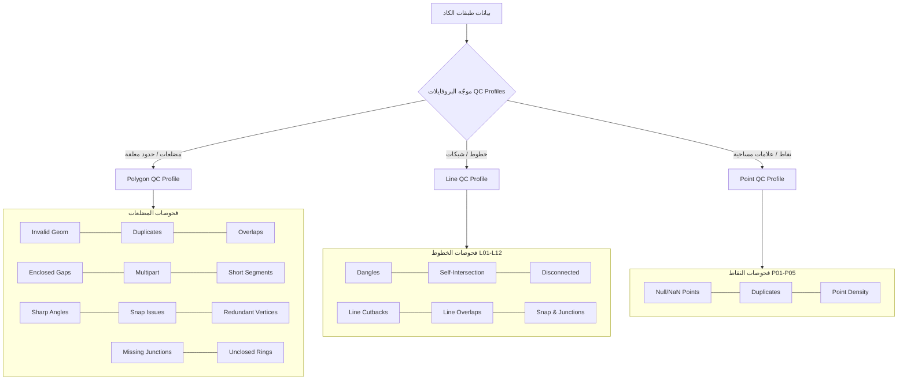

# CAD Standards & Layer QC Analyzer — Comprehensive Guide
# الدليل الشامل لأداة فحص ومطابقة معايير الكاد وضبط الجودة الطبولوجية

> **Production-Ready ArcGIS Pro Python Toolbox (`.pyt`)**  
> **أداة متقدمة متوافقة بالكامل مع ArcGIS Pro لفحص وتدقيق مخططات الكاد (CAD) ومطابقتها للمعايير والتحقق الطبولوجي والهندسي.**

---

## Table of Contents / الفهرس

- [العربية (Arabic Guide)](#-الدليل-باللغة-العربية)
  - [1. مقدمة وفلسفة الأداة](#1-مقدمة-وفلسفة-الأداة)
  - [2. المميزات الرئيسية](#2-المميزات-الرئيسية)
  - [3. شرح الأدوات بالتفصيل والمعاملات](#3-شرح-الأدوات-بالتفصيل-والمعاملات)
    - [الأداة الأولى: مطابقة الكاد المرجعي (CAD Reference Comparison QC)](#الأداة-الأولى-فحص-ومطابقة-الكاد-المرجعي-cad-reference-comparison-qc)
    - [الأداة الثانية: فحص الجودة الهندسية والطبولوجية (Geometry & Topology QC Analyzer)](#الأداة-الثانية-فحص-الجودة-الهندسية-والطبولوجية-geometry--topology-qc-analyzer)
  - [4. منظومة الفحوصات الهندسية والبروفايلات المتخصصة (Geometry QC Profiles)](#4-منظومة-الفحوصات-الهندسية-والبروفايلات-المتخصصة-geometry-qc-profiles)
    - [بروفايل المضلعات (Polygon QC Profile)](#أ-بروفايل-المضلعات-polygon-qc-profile)
    - [بروفايل الخطوط (Line QC Profile)](#ب-بروفايل-الخطوط-line-qc-profile)
    - [بروفايل النقاط (Point QC Profile)](#ج-بروفايل-النقاط-point-qc-profile)
    - [إلزام المخطط المستلم بمعايير المرجع عند اختلاف نوع الهندسة](#د-إلزام-المخطط-المستلم-بمعايير-المرجع-عند-اختلاف-نوع-الهندسة)
  - [5. الفحص التلقائي لكل طبقة كاد (Per-Layer QC)](#5-الفحص-التلقائي-لكل-طبقة-كاد-per-layer-qc)
  - [6. قواعد التعامل مع الطبقة 0 (Layer '0' Standards)](#6-قواعد-التعامل-مع-الطبقة-0-layer-0-standards)
  - [7. التقارير والمخرجات وقاعدة بيانات النتائج](#7-التقارير-والمخرجات-وقاعدة-بيانات-النتائج)
    - [لوحة التحكم التفاعلية ثنائية اللغة (Bilingual HTML Dashboard)](#1-لوحة-التحكم-التفاعلية-ثنائية-اللغة-bilingual-html-dashboard)
    - [تقرير الإكسل المتقدم (.xlsx)](#2-تقرير-الإكسل-المتقدم-xlsx)
    - [قاعدة بيانات النتائج ومجموعة الطبقات في الخريطة (CAD_QC_Results.gdb & Group Layer)](#3-قاعدة-بيانات-النتائج-ومجموعة-الطبقات-في-الخريطة-cad_qc_resultsgdb--group-layer)
    - [الملخص النصي (.txt)](#4-الملخص-النصي-txt)
  - [8. دليل الاستخدام في ArcGIS Pro](#8-دليل-الاستخدام-في-arcgis-pro)
- [English Guide](#-english-guide)
  - [1. Overview & Core Philosophy](#1-overview--core-philosophy)
  - [2. Key Capabilities](#2-key-capabilities)
  - [3. Detailed Tool Specifications](#3-detailed-tool-specifications)
    - [Tool 1: CAD Reference-Based Comparison QC](#tool-1-cad-reference-based-comparison-qc)
    - [Tool 2: Geometry & Topology QC Analyzer](#tool-2-geometry--topology-qc-analyzer)
  - [4. Geometry-Aware QC Profiles Suite](#4-geometry-aware-qc-profiles-suite)
    - [Polygon QC Profile](#a-polygon-qc-profile)
    - [Line QC Profile](#b-line-qc-profile)
    - [Point QC Profile](#c-point-qc-profile)
    - [Enforcing Reference Standards on Mismatches](#d-enforcing-reference-standards-on-mismatches)
  - [5. Automatic Per-Layer Processing](#5-automatic-per-layer-processing)
  - [6. Reserved CAD Layer '0' Standards & Rules](#6-reserved-cad-layer-0-standards--rules)
  - [7. Deliverables & Results Geodatabase](#7-deliverables--results-geodatabase)
    - [Dual-Language Interactive HTML Dashboard](#1-dual-language-interactive-html-dashboard)
    - [Multi-Sheet Excel Workbook](#2-multi-sheet-excel-workbook)
    - [Dedicated Geodatabase, Standalone Table & Group Layer (CAD_QC_Results.gdb)](#3-dedicated-geodatabase-standalone-table--group-layer-cad_qc_resultsgdb)
    - [Plain Text Log](#4-plain-text-log)
  - [8. Step-by-Step Tutorial for ArcGIS Pro](#8-step-by-step-tutorial-for-arcgis-pro)
- [Project Architecture / الهيكل البرمجي للمشروع](#-project-architecture--الهيكل-البرمجي-للمشروع)

---

# 🇸🇦 الدليل باللغة العربية

---

## 1. مقدمة وفلسفة الأداة

في مشاريع التخطيط العمراني، والمسح الجغرافي، واعتماد المخططات الهندسية، تمثل عملية مراجعة ملفات الكاد الواردة (Received CAD) ومطابقتها للمخططات المعتمدة (Approved/Reference CAD) تحدياً كبيراً يتطلب ساعات طويلة من التدقيق اليدوي المعرض للخطأ.

تم بناء هذه الأداة كـ **ArcGIS Pro Python Toolbox (`.pyt`)** لتوفر حلاً متكاملاً يجيب على سؤالين أساسيين:
1. **ما الذي تغير بين المخطط المعتمد والمخطط المستلم؟**  
   (هل أضيفت طبقات جديدة؟ هل حذفت طبقات؟ هل تغيرت أنواع العناصر الهندسية كتحويل المضلعات إلى خطوط مفتوحة؟ هل تغيرت الألوان أو سماكات الخطوط؟).
2. **ما هي العيوب الهندسية والطبولوجية الموجودة داخل البيانات نفسها؟**  
   (تداخلات، تكرارات، زوايا حادة شاذة، عدم تطابق العقد، فجوات، أجزاء متناهية الصغر، أخطاء الإغلاق).

### فلسفة التعلم الديناميكي (Dynamic Standard Learning)
الأداة **لا تفرض أي قواعد مسبقة أو شروط صلبة مبرمجة كودياً**. بدلاً من ذلك، تقوم الأداة بقراءة وفحص المخطط المرجعي المعتمد (Reference CAD) ديناميكياً، وتتعلم منه المعيار المقبول لكل طبقة:
- ما هو نوع الهندسة السائد؟ (Dominant Geometry Type)
- هل الطبقة تتطلب إغلاقاً هندسياً (Closed Polylines / Polygons)؟
- ما هي الألوان وسماكات وأنواع الخطوط المعتمدة لكل طبقة؟  
ثم تطبق ما تعلمته بدقة 100% على المخطط المستلم.

---

## 2. المميزات الرئيسية

- **أداة قراءة فقط 100% (Strictly Read-Only)**: لا تعدل ولا تحذف ولا تغير أياً من البيانات المصدرية إطلاقاً.
- **دعم كامل لملفات الأوتوكاد مباشرة (`.dwg`, `.dxf`)**: تدعم اختيار ملف الكاد بالكامل كـ `CAD Drawing Dataset` أو اختيار الطبقات الفرعية (`Polyline`, `Polygon`, `Point`...).
- **بروفايلات هندسية متخصصة (Geometry-Aware Profiles)**: توجيه تلقائي للفحوصات الهندسية بحسب نوع الطبقة (مضلعات، خطوط، نقاط).
- **إلزام المخطط المستلم بالمعيار المرجعي**: عند وجود اختلاف في نوع الهندسة (مثل تسليم طبقة `parcel` كـ Polylines بدلاً من Polygons)، لا تتخطى الأداة الفحص، بل تلزم الطبقة ببروفايل المضلعات المعتمد وتكشف الحلقات غير المغلقة.
- **فحص هندسي وطبولوجي تلقائي لكل طبقة (Per-Layer Automation)**: تقسيم العناصر وفحص كل طبقة كاد بشكل مستقل لمنع التداخلات الخاطئة بين الطبقات المختلفة (مثل الشوارع مع الأراضي).
- **محرك فهارس مكانية سريع في الذاكرة ($O(N \log N)$)**: شبكة مكانية (Spatial Grid) وفهرسة إحداثيات الرؤوس (Vertex Hash Indexing) لسرعة فائقة.
- **تقارير متطورة ثنائية اللغة ومخرجات جغرافية منظمة**:
  - لوحة تحكم تفاعلية ثنائية اللغة (`.html` إنجليزي و `_ar.html` عربي) مع زر تبديل فوري وشبكة KPI متجاوبة.
  - تقرير إكسل احترافي (`.xlsx`) متعدد الأوراق عبر مكتبة `openpyxl`.
  - قاعدة بيانات جغرافية مستقلة (`CAD_QC_Results.gdb`) داخل مجلد التقارير تضم جدولاً وصفياً شاملاً ومجموعة طبقات Feature Classes مجمعة في Group Layer في الخريطة.

---

## 3. شرح الأدوات بالتفصيل والمعاملات

يحتوي التول بوكس على أداتين رئيسيتين:

---

### الأداة الأولى: فحص ومطابقة الكاد المرجعي (`CADReferenceComparisonQCTool`)
**الهدف**: المقارنة الشاملة بين مخطط معتمد (Reference) ومخطط مستلم (Received) مع إمكانية تشغيل الفحص الهندسي والطبولوجي المدمج.

#### معاملات الإدخال (Parameters):
| الباراميتر (Parameter) | النوع (Type) | الحالة | القيمة الافتراضية | الشرح |
| :--- | :--- | :--- | :--- | :--- |
| **Reference CAD / Approved Dataset** | Feature Layer / Class / CAD Drawing | إجباري | — | المخطط المرجعي المعتمد (الأساس). |
| **Reference Layer Field** | Field | اختياري | `Layer` | حقل اسم الطبقة (يكتشفه النظام تلقائياً). |
| **Received CAD / Client Dataset** | Feature Layer / Class / CAD Drawing | إجباري | — | المخطط المستلم من العميل أو المكتب الهندسي. |
| **Received Layer Field** | Field | اختياري | `Layer` | حقل اسم الطبقة للمخطط المستلم. |
| **Comparison Scope** | String | اختياري | `All Layers` | نطاق الفحص: جميع الطبقات أو الطبقات المغلقة فقط. |
| **Dominant Geometry Threshold** | Double | اختياري | `0.50` (50%) | نسبة اعتبار نوع الهندسة هو السائد في الطبقة. |
| **Closure Tolerance** | Double | اختياري | `0.01` (1 سم) | أقصى مسافة مقبولة بين نقطة البداية والنهاية لاعتبار الخط مغلقاً. |
| **Output Folder for Reports** | Folder | إجباري | — | المجلد الذي ستُحفظ فيه التقارير وقاعدة بيانات النتائج `CAD_QC_Results.gdb`. |
| **Compare Feature Counts** | Boolean | اختياري | `False` | مقارنة أعداد العناصر (معطل افتراضياً للتركيز على جودة المعايير والطبقات). |
| **Compare Geometries** | Boolean | اختياري | `True` | التحقق من تطابق أنواع العناصر واكتشاف العناصر الدخيلة. |
| **Compare Closure** | Boolean | اختياري | `True` | فحص إغلاق الخطوط ومقارنتها بنسبة الإغلاق في الأصل. |
| **Compare Colors / Lineweights / Types** | Boolean | اختياري | `True` | مقارنة خصائص الكاد (الألوان، السماكات، أنواع الخطوط). |
| **Case-Sensitive Layer Names** | Boolean | اختياري | `False` | حساسية حالة الأحرف في أسماء الطبقات (بالإنجليزية). |
| **Trim Layer Name Whitespace** | Boolean | اختياري | `True` | حذف المسافات الزائدة من بداية ونهاية اسم الطبقة. |
| **Run Geometry QC on Received CAD** | Boolean | اختياري | `False` | تشغيل الفحص الهندسي والطبولوجي الشامل على المخطط المستلم وتصدير طبقات الأخطاء المكانية. |
| **Generate Excel / HTML / Text Reports** | Boolean | اختياري | `True` | توليد التقارير المتنوعة. |
| **Output Standalone Issues Table** | DETable | اختياري | — | مسار حفظ جدول وصفي للأخطاء (بدون Shape وهمي). |

---

### الأداة الثانية: فحص الجودة الهندسية والطبولوجية (`GeometryQCTool`)
**الهدف**: فحص أي طبقة كاد أو طبقة جغرافية والتحقق من سلامتها الهندسية والطبولوجية عبر البروفايلات الهندسية المتخصصة.

#### معاملات الإدخال (Parameters):
| الباراميتر (Parameter) | النوع (Type) | الحالة | القيمة الافتراضية | الشرح |
| :--- | :--- | :--- | :--- | :--- |
| **Input Feature Class / CAD Drawing** | Feature Layer / Class / CAD Drawing | إجباري | — | ملف الكاد أو الطبقة المراد فحصها. |
| **CAD Layer Field (Optional)** | Field | اختياري | `Layer` | حقل اسم الطبقة (يكتشفه النظام تلقائياً). |
| **Target CAD Layer** | String (Dropdown) | اختياري | `All Layers` | اختيار فحص طبقة محددة أو فحص جميع الطبقات تلقائياً. |
| **Layer Display Name / Label** | String | اختياري | `GeometryQC` | تسمية تعريفية للتقرير. |
| **Short Segment Threshold (meters)** | Double | اختياري | `0.10` م (10 سم) | أقل طول مسموح به لأي ضلع. |
| **Sharp Angle Threshold (degrees)** | Double | اختياري | `5.0°` درجات | أصغر زاوية مسموح بها لاكتشاف البروزات الحادة الشاذة. |
| **Snap Issue Threshold (meters)** | Double | اختياري | `0.01` م (1 سم) | مسافة الكشف عن العقد القريبة غير المتطابقة (Undershoot/Overshoot). |
| **Redundant Vertex Angle (degrees)** | Double | اختياري | `179.9°` درجة | كشف الرؤوس الزائدة المتتالية على خط مستقيم. |
| **Missing Junction Threshold (meters)** | Double | اختياري | `0.01` م (1 سم) | كشف تقاطعات العقد المفقودة (T-Junctions). |
| **Overlap Area Tolerance (m²)** | Double | اختياري | `0.0001` م² | الحد الأدنى لمساحة التداخل المعتبرة كخطأ. |
| **Enclosed Gap Area Tolerance (m²)** | Double | اختياري | `0.001` م² | الحد الأقصى لمساحة الفجوات الضيقة المحصورة بين المضلعات. |
| **Output Folder for Reports** | Folder | إجباري | — | مجلد حفظ التقارير وقاعدة بيانات النتائج. |
| **Check Toggles (10 Checks)** | Boolean | اختياري | `True` (الكل) | إمكانية تفعيل أو تعطيل أي من الفحوصات العشرة بشكل مستقل. |
| **Generate Excel / HTML / Text Reports** | Boolean | اختياري | `True` | خيارات استخراج التقارير. |
| **Output Standalone Issues Table** | DETable | اختياري | — | مسار حفظ جدول وصفي للأخطاء. |

---

## 4. منظومة الفحوصات الهندسية والبروفايلات المتخصصة (Geometry QC Profiles)

تتميز الأداة بمنظومة فحص ذكية توجه كل طبقة إلى البروفايل الهندسي المناسب لها:



### أ. بروفايل المضلعات (Polygon QC Profile)
مخصص لقطع الأراضي، المباني، والمناطق التنظيمية:
1. **`CHK_INVALID_GEOM`**: كشف التقاطعات الذاتية والأشكال غير الصالحة.
2. **`CHK_DUPLICATE`**: كشف المضلعات المتطابقة بنسبة $\ge 99.9\%$.
3. **`CHK_OVERLAP`**: كشف التداخلات بين المضلعات المتجاورة مع حساب المساحة بدقة.
4. **`CHK_GAP`**: كشف الفجوات والجيوب الهوائية المحصورة بين الأراضي.
5. **`CHK_MULTIPART`**: كشف الكيانات متعددة الأجزاء غير المتصلة.
6. **`CHK_SHORT_SEG`**: كشف الأضلاع الميكروسكوبية ($< 10$ سم).
7. **`CHK_ANGLE`**: كشف الزوايا الحادة الشاذة والارتدادات الإبرية ($< 5^\circ$).
8. **`CHK_SNAP`**: كشف العقد غير المتطابقة والمسافات الضيقة.
9. **`CHK_REDUNDANT`**: كشف الرؤوس الزائدة على الخطوط المستقيمة ($> 179.9^\circ$).
10. **`CHK_JUNCTION`**: كشف التقاطعات والعقد المفقودة (T-Junctions).
11. **`UNCLOSED_RING`**: كشف الحلقات المفتوحة التي تمنع تحويل الخطوط إلى مضلعات سليمة.

### ب. بروفايل الخطوط (Line QC Profile)
مخصص لمحاور الطرق، خطوط الخدمات، والشبكات (فحوصات L01 إلى L12):
- النهايات السائبة غير المتصلة (Dangles).
- التقاطعات الذاتية للخطوط (Line Self-Intersections).
- الخطوط المعزولة غير المرتبطة بالشبكة (Disconnected Lines).
- الارتدادات العكسية والزوايا الحادة (Cutbacks).
- تراكب الخطوط المتطابقة جزئياً (Line Overlaps).

### ج. بروفايل النقاط (Point QC Profile)
مخصص للنقاط المساحية، أعمدة الإنارة، ومحابس الشبكات (فحوصات P01 إلى P05):
- النقاط عديمة الإحداثيات أو الشاذة (Null/NaN Points).
- النقاط المكررة تماماً فوق بعضها (Duplicate Points).
- النقاط المتقاربة جداً داخل نطاق التسامح (Near-Duplicates).
- التوزيع والتكدس المكاني الشاذ (Density Anomaly).

### د. إلزام المخطط المستلم بمعايير المرجع عند اختلاف نوع الهندسة
إذا استلمت طبقة أراضٍ (`parcel`) مرسومة كخطوط مفتوحة أو مغلقة (Polylines)، بينما المخطط المرجعي المعتمد يعرّفها كمضلعات (Polygons):
- **لا تتجاهل الأداة الطبقة**: تقوم بتفعيل بروفايل المضلعات المعتمد فوراً على عناصر الطبقة.
- **كشف عيوب الإغلاق**: يتم توجيه كل خط غير مقفل كخطأ `UNCLOSED_RING` و `CLOSURE_DIFFERENCE` مع تحديد إحداثيات ومكان الفجوة بدقة، مما يسهل معالجتها في ثوانٍ.

---

## 5. الفحص التلقائي لكل طبقة كاد (Per-Layer QC)

- **عزل الطبقات التلقائي**: تقوم الأداة بقراءة حقل `Layer` وتوزيع العناصر على طبقات مستقلة وفحص كل طبقة على حدة.
- **منع الإنذارات الكاذبة**: يمنع تماماً احتساب تداخل الشوارع مع حدود الأراضي أو الأرصفة كأخطاء تداخل.
- **تقارير موجهة**: يظهر في التقرير جدول تفصيلي مخصص يوضح حالة كل طبقة وعدد عناصرها وعدد الأخطاء فيها على حدة.

---

## 6. قواعد التعامل مع الطبقة 0 (Layer '0' Standards)

طبقة **`0`** (وكذلك طبقة `Defpoints`) في الأوتوكاد هي طبقات نظام محجوزة:
- **المعيار الهندسي والمساحي الصارم**: يجب **ألا تحتوي الطبقة `0` على أي عناصر أو أشكال مرسومة إطلاقاً**.
- **طريقة تعامل الأداة**:
  1. **في المخطط المرجعي (Reference)**: إذا احتوى المرجع على عناصر في الطبقة `0`، تصدر الأداة تحذيراً صريحاً (`CHK_RESERVED_LAYER`).
  2. **في المخطط المستلم (Received)**: إذا وجدت عناصر في الطبقة `0`، يتم تسجيلها كخطأ مخالفة معايير الكاد.
  3. **الامتثال الإيجابي**: إذا نظف العميل الطبقة `0` في المخطط المستلم وحذف عناصرها، تحتسب الأداة ذلك نجاحاً (`PASS`) ولا تعتبره نقصاً في الطبقات (`MISSING_LAYER`).

---

## 7. التقارير والمخرجات وقاعدة بيانات النتائج

توفر الأداة حزمة مخرجات متكاملة تُحفظ في مجلد المخرجات المحدد:

```text
Output Folder/
├── CAD_QC_Report_YYYYMMDD_HHMMSS.html        # لوحة التحكم التفاعلية باللغة الإنجليزية (الأساسية)
├── CAD_QC_Report_YYYYMMDD_HHMMSS_ar.html     # لوحة التحكم التفاعلية باللغة العربية (RTL)
├── CAD_QC_Report_YYYYMMDD_HHMMSS.xlsx        # تقرير إكسل احترافي متعدد الأوراق
├── CAD_QC_Report_YYYYMMDD_HHMMSS.txt         # ملخص نصي سريع
└── CAD_QC_Results.gdb/                       # قاعدة بيانات جغرافية مخصصة للنتائج
    ├── CAD_QC_All_Issues_Table               # جدول وصفي لجميع الأخطاء (بدون Shape وهمي)
    └── CAD_Geometry_QC_Errors (Dataset)      # حاوية الطبقات الهندسية للأخطاء المكتشفة
        ├── QC01_Invalid_Geometries
        ├── QC02_Overlaps
        └── ... (تُنشأ فقط للفحوصات التي بها أخطاء)
```

### 1. لوحة التحكم التفاعلية ثنائية اللغة (`Bilingual HTML Dashboard`)
- **لوحتان متكاملتان**:
  - النسخة الإنجليزية الأساسية: `CAD_QC_Report_YYYYMMDD_HHMMSS.html`.
  - النسخة العربية المعتمدة: `CAD_QC_Report_YYYYMMDD_HHMMSS_ar.html` (واجهة RTL كاملة ومصطلحات هندسية رصينة).
- **زر التبديل السريع**: زر تفاعلي `🌐 العربية` / `🌐 English` في أعلى الشريط للتنقل السلس والفوري.
- **شبكة مؤشرات أداء متجاوبة (Responsive Auto-Fit KPI Grid)**:
  تصميم مرن باستخدام `grid-template-columns: repeat(auto-fit, minmax(100px, 1fr))` لضبط البطاقات في سطر واحد متناسق.
- **أزرار الفلترة**: فلترة سريعة لعرض الأخطاء فقط (`Errors`)، أو التحذيرات (`Warnings`)، أو الطبقات الناجحة (`Passed`).
- **سجل الأخطاء التفصيلي**: جدول يعرض أول 500 خطأ مع رقم العنصر (`OID`)، ونوع العيب، والإحداثيات الدقيقة $(X, Y)$.

### 2. تقرير الإكسل المتقدم (`.xlsx`)
- مصمم بألوان عصرية عبر مكتبة `openpyxl`:
  - **`Summary`**: نظرة عامة شاملة وتاريخ الفحص ونظام الإحداثيات المستخدم.
  - **`Reference Profile`**: المعايير المستخلصة ديناميكياً من المخطط المرجعي المعتمد.
  - **`Layer Overview`**: مصفوفة مطابقة الطبقات بالشارات الملونة (`PASS`, `ERROR`, `WARNING`, `MISSING`, `EXTRA`).
  - **`Geometry QC Summary`**: جدول يلخص نتائج الفحوصات الهندسية وتفصيل الأخطاء لكل طبقة كاد.
  - **`Geometry QC Issues`**: قائمة كاملة بكل خطأ وعمود يوضح اسم الـ **CAD Layer** ورقم العنصر $(X, Y)$.
  - **`Issue Details`**: جدول الأخطاء الشامل ببياناته القياسية.

### 3. قاعدة بيانات النتائج ومجموعة الطبقات في الخريطة (`CAD_QC_Results.gdb & Group Layer`)
- **حفظ مستقل**: تُنشأ داخل مجلد التقارير المحدد (`out_folder`) لحماية `Default.gdb` من التراكم.
- **هيكلية مزدوجة ونظيفة (Dual-Format)**:
  1. **جدول وصفي شامل (`CAD_QC_All_Issues_Table`)**: جدول بيانات وصفي حقيقي (Standalone Table) يحتوي على جميع المشكلات والخصائص بدون Shape وهمي.
  2. **طبقات مكانية مستقلة لكل خطأ (`Feature Classes`)**: داخل Feature Dataset مسمى `CAD_Geometry_QC_Errors`، يتم إنشاء طبقة مكانية مستقلة لكل نوع خطأ وُجدت له عناصر معيبة فقط.
- **التجميع التلقائي في الخريطة (Group Layer)**:
  تُضاف جميع طبقات الأخطاء الهندسية تلقائياً داخل مجموعة طبقات منظمة باسم **`CAD Geometry QC Errors`** في لوحة المحتويات (Contents Pane)، بينما يُضاف الجدول الوصفي لقسم Standalone Tables.
- **حل تضارب الأسماء التلقائي**:
  حذف أي طبقات أو جداول سابقة ناتجة عن تشغيلات قديمة داخل الـ GDB لمنع ظهور خطأ Esri `ERROR 002851`.

### 4. الملخص النصي (`.txt`)
- ملف نصي خفيف ومثالي للمراجعة السريعة أو الأرشفة في السجلات وسير العمل المؤتمت.

---

## 8. دليل الاستخدام في ArcGIS Pro

1. افتح مشروعك في **ArcGIS Pro**.
2. من لوحة **Catalog Pane**:
   - اضغط بزر الفأرة الأيمن على مجلد **Toolboxes** واختر **Add Toolbox**.
   - اختر الملف `CAD_QC_Toolbox.pyt`.
3. لتشغيل **مقارنة الكاد المرجعي**:
   - انقر نقراً مزدوجاً على أداة `CAD Reference-Based Comparison QC`.
   - اختر ملف الكاد المعتمد في `Reference CAD`.
   - اختر ملف الكاد المستلم في `Received CAD`.
   - حدد مجلد المخرجات `Output Folder for Reports`.
   - فعّل خيار `Run Geometry QC on Received CAD (Combined Workflow)` لفحص الجيومتري أيضاً.
   - اضغط **Run**.
4. لتشغيل **الفحص الهندسي والطبولوجي الشامل**:
   - انقر نقراً مزدوجاً على أداة `Geometry & Topology QC Analyzer`.
   - اختر ملف الكاد (مثل `edited.dwg`) أو أي طبقة مرسومة.
   - اختر `Target CAD Layer` (اتركها `All Layers` لفحص جميع الطبقات تلقائياً).
   - حدد مجلد حفظ التقارير واضغط **Run**.

---

# 🇬🇧 English Guide

---

## 1. Overview & Core Philosophy

In civil engineering, urban planning, and cadastre management, reviewing CAD deliverables submitted by contractors or consultants is traditionally a tedious, error-prone manual task.

The **CAD Standards & Layer QC Toolbox** is a production-grade **ArcGIS Pro Python Toolbox (`.pyt`)** designed to answer two fundamental Quality Control questions:
1. **Reference-Based CAD Comparison**:  
   *"What changed between the approved Original CAD and the Received/Client CAD submission?"*  
   Detects missing/extra layers, geometry mix shifts, polyline closure regressions, and CAD property variations (colors, lineweights, linetypes).
2. **Geometry-Aware Quality Control**:  
   *"What geometric and topological defects exist inside the data itself?"*  
   Identifies overlaps, duplicates, sliver gaps, sharp spikes, snap issues, missing junctions, redundant vertices, unclosed rings, and invalid shapes.

### Dynamic Standard Learning (Zero Hardcoding)
The engine does **not** rely on rigid, hardcoded configuration files. Instead, it inspects the authoritative Reference CAD dynamically:
- Discovers the baseline layer standard.
- Learns the dominant geometry type and polyline closure rate.
- Learns color, lineweight, and linetype profiles.  
It then holds the Received CAD to the exact standards learned from the reference drawing.

---

## 2. Key Capabilities

- **100% Read-Only Safety**: Inspects and queries data using non-destructive search cursors. Source files are never modified.
- **Native AutoCAD `.dwg` and `.dxf` Support**: Processes both complete CAD drawing datasets (`DECADDrawingDataset`) and discrete feature layers.
- **Geometry-Aware QC Profiles**: Dispatches specialized checking suites according to layer geometry (Polygon, Line, Point).
- **Enforces Reference Standards on Mismatches**: If a parcel layer is submitted as polylines instead of polygons, the engine does not skip QC; it enforces the Reference-expected Polygon profile and identifies boundary defects and unclosed rings.
- **Automatic Per-Layer Geometry QC**: Partitions features by their native CAD `Layer` attribute field, running topology and geometry checks strictly within each CAD layer.
- **High-Performance Spatial Indexing ($O(N \log N)$)**: In-memory 2D spatial grid index and coordinate hash tables for near-instant execution.
- **Bilingual Deliverables & Clean Geodatabase Output**:
  - Dual-language HTML dashboard (`.html` English and `_ar.html` Arabic) with live language toggle and responsive auto-fit KPI grid.
  - Multi-sheet styled Excel workbook (`.xlsx`) via `openpyxl`.
  - Dedicated results Geodatabase (`CAD_QC_Results.gdb`) located directly in the reports folder with standalone descriptive table, grouped feature classes, and conflict resolution.

---

## 3. Detailed Tool Specifications

---

### Tool 1: CAD Reference-Based Comparison QC (`CADReferenceComparisonQCTool`)

#### Parameter Reference:
| Parameter | Type | Direction | Default | Description |
| :--- | :--- | :--- | :--- | :--- |
| **Reference CAD / Approved Dataset** | Feature Layer / Class / CAD Drawing | Input | *Required* | Authoritative approved CAD dataset. |
| **Reference Layer Field** | Field | Input | `Layer` (auto) | Attribute field containing CAD layer names. |
| **Received CAD / Client Dataset** | Feature Layer / Class / CAD Drawing | Input | *Required* | Submitted CAD dataset to be validated. |
| **Received Layer Field** | Field | Input | `Layer` (auto) | Attribute field containing CAD layer names. |
| **Comparison Scope** | GPString | Input | `All Layers` | Scope: All Layers or closed-geometry layers. |
| **Dominant Geometry Threshold** | GPDouble | Input | `0.50` (50%) | Threshold ratio for dominant geometry assignment. |
| **Closure Tolerance** | GPDouble | Input | `0.01` (1 cm) | Maximum endpoint distance to qualify as closed polyline. |
| **Output Folder for Reports** | DEFolder | Input | *Required* | Directory where reports and `CAD_QC_Results.gdb` are saved. |
| **Compare Feature Counts** | GPBoolean | Input | `False` | Flags count discrepancies (disabled by default to focus on quality). |
| **Compare Geometries** | GPBoolean | Input | `True` | Detects unexpected entity types & geometry distribution changes. |
| **Compare Closure** | GPBoolean | Input | `True` | Flags unclosed polylines where closed polylines were expected. |
| **Compare Colors / Lineweights / Types** | GPBoolean | Input | `True` | Analyzes CAD property distributions. |
| **Case-Sensitive Layer Names** | GPBoolean | Input | `False` | Toggles case sensitivity for layer names. |
| **Trim Layer Name Whitespace** | GPBoolean | Input | `True` | Strips leading/trailing spaces from layer names. |
| **Run Geometry QC on Received CAD** | GPBoolean | Input | `False` | Mode C: executes geometry suite on Received CAD and exports spatial defect layers. |
| **Generate Excel / HTML / Text Reports** | GPBoolean | Input | `True` | Generates formatted deliverables. |
| **Output Standalone Issues Table** | DETable | Output | *Optional* | Standalone descriptive table (no dummy Shape geometry). |

---

### Tool 2: Geometry & Topology QC Analyzer (`GeometryQCTool`)

#### Parameter Reference:
| Parameter | Type | Direction | Default | Description |
| :--- | :--- | :--- | :--- | :--- |
| **Input Feature Class / CAD Drawing** | Feature Layer / Class / CAD Drawing | Input | *Required* | Target CAD file or GIS layer. |
| **CAD Layer Field (Optional)** | Field | Input | `Layer` (auto) | Layer field for grouping features. |
| **Target CAD Layer** | GPString (Dropdown) | Input | `All Layers` | Select specific CAD layer or `All Layers`. |
| **Layer Display Name / Label** | GPString | Input | `GeometryQC` | Label prefix in generated reports. |
| **Short Segment Threshold (meters)** | GPDouble | Input | `0.10` m (10 cm) | Minimum allowable segment length. |
| **Sharp Angle Threshold (degrees)** | GPDouble | Input | `5.0°` | Spikes and acute angle threshold. |
| **Snap Issue Threshold (meters)** | GPDouble | Input | `0.01` m (1 cm) | Undershoot / overshoot search distance. |
| **Redundant Vertex Angle (degrees)** | GPDouble | Input | `179.9°` | Collinear vertex removal threshold. |
| **Missing Junction Threshold (meters)** | GPDouble | Input | `0.01` m (1 cm) | Node-to-edge junction threshold. |
| **Overlap Area Tolerance (m²)** | GPDouble | Input | `0.0001` m² | Minimum area to flag as overlap. |
| **Enclosed Gap Area Tolerance (m²)** | GPDouble | Input | `0.001` m² | Maximum enclosed gap area to flag. |
| **Output Folder for Reports** | DEFolder | Input | *Required* | Destination directory for reports and results GDB. |
| **10 Check Toggles** | GPBoolean | Input | `True` (All) | Independent switches for all checks. |
| **Generate Excel / HTML / Text Reports** | GPBoolean | Input | `True` | Toggles report outputs. |
| **Output Standalone Issues Table** | DETable | Output | *Optional* | Standalone descriptive table for issues. |

---

## 4. Geometry-Aware QC Profiles Suite

The engine dynamically dispatches each layer to its specialized QC profile:

### A. Polygon QC Profile
Designed for parcel boundaries, zoning envelopes, and buildings:
1. `CHK_INVALID_GEOM`: Self-intersections, bow-ties, NaN coordinates.
2. `CHK_DUPLICATE`: 100% coincident duplicates ($\ge 99.9\%$).
3. `CHK_OVERLAP`: Overlapping interior areas with exact area calculation.
4. `CHK_GAP`: Enclosed void holes and slivers between adjacent polygons.
5. `CHK_MULTIPART`: Disjoint multipart entities where singleparts are required.
6. `CHK_SHORT_SEG`: Micro-edges shorter than threshold ($< 10$ cm).
7. `CHK_ANGLE`: Acute kickback spikes ($< 5^\circ$).
8. `CHK_SNAP`: Unsnapped near-coincident vertices ($< 1$ cm).
9. `CHK_REDUNDANT`: Superfluous collinear vertices ($> 179.9^\circ$).
10. `CHK_JUNCTION`: Missing nodes at boundary intersections.
11. `UNCLOSED_RING`: Unclosed polyline boundaries preventing valid polygon conversion.

### B. Line QC Profile
Designed for road centerlines, utility corridors, and right-of-ways (Checks L01 through L12):
- Line Self-Intersections.
- Unconnected Dangles.
- Disconnected Network Lines.
- Cutbacks and Acute Directional Spikes.
- Partial and Coincident Line Overlaps.

### C. Point QC Profile
Designed for survey monuments, utility poles, and point markers (Checks P01 through P05):
- Null / NaN Coordinate Points.
- Exactly Coincident Duplicate Points.
- Near-Duplicate Points within tolerance.
- Spatial Density and Clustering Anomalies.

### D. Enforcing Reference Standards on Mismatches
When a received layer has a geometry type mismatch (e.g. `parcel` is polyline instead of polygon):
- The tool **does not skip QC**.
- It enforces the Reference-expected Polygon profile and identifies boundary defects, reporting open loops as `UNCLOSED_RING` and `CLOSURE_DIFFERENCE` with pinpoint $(X, Y)$ gap locations.

---

## 5. Automatic Per-Layer Processing

When analyzing CAD submissions:
1. **Dynamic Partitioning**: Features in CAD files belong to diverse layers (`roads`, `lots`, `zoning`, `easements`).
2. **Layer Isolation**: The tool automatically groups features by their CAD layer attribute and executes topology tests within each layer independently.
3. **Elimination of False Positives**: Road boundaries touching or intersecting lot boundaries are no longer incorrectly flagged as polygon overlaps or snap errors.
4. **Targeted Reporting**: Issues are tagged with their specific `layer_name`, producing clear, actionable layer summaries.

---

## 6. Reserved CAD Layer '0' Standards & Rules

In AutoCAD, Layer **`0`** (and `Defpoints`) are reserved system layers:
- **Strict Quality Standard**: **Layer `0` must be empty** (0 drawing features). It is reserved solely for block/symbol definitions and must never host final submission entities.
- **How the Tool Enforces Layer `0` Quality**:
  1. **Reference CAD (`REFERENCE`)**: If the approved Reference CAD contains features on Layer `0`, the tool explicitly flags a `WARNING` (`CHK_RESERVED_LAYER`).
  2. **Received CAD (`RECEIVED`)**: If the submitted CAD contains features on Layer `0`, a `WARNING` is triggered and documented across all reports.
  3. **Intelligent Compliance Recognition**: If the Reference drawing had features on Layer `0` but the contractor cleaned up and purged Layer `0` in the Received CAD, the engine marks it as compliant (`PASS`) and commends the cleanup.

---

## 7. Deliverables & Results Geodatabase

Every run produces a clean deliverable package in the selected output folder:

```text
Output Folder/
├── CAD_QC_Report_YYYYMMDD_HHMMSS.html        # Primary English interactive dashboard
├── CAD_QC_Report_YYYYMMDD_HHMMSS_ar.html     # Dedicated Arabic interactive dashboard (RTL)
├── CAD_QC_Report_YYYYMMDD_HHMMSS.xlsx        # Comprehensive multi-sheet Excel workbook
├── CAD_QC_Report_YYYYMMDD_HHMMSS.txt         # Lightweight text summary
└── CAD_QC_Results.gdb/                       # Dedicated Geodatabase for spatial & tabular results
    ├── CAD_QC_All_Issues_Table               # Standalone table of all issues (clean, no dummy shape)
    └── CAD_Geometry_QC_Errors (Dataset)      # Feature Dataset hosting spatial error layers
        ├── QC01_Invalid_Geometries
        ├── QC02_Overlaps
        └── ... (only generated for checks with defects)
```

### 1. Dual-Language Interactive HTML Dashboard
- **English Primary & Arabic Dedicated**:
  - `CAD_QC_Report_YYYYMMDD_HHMMSS.html`: English dashboard.
  - `CAD_QC_Report_YYYYMMDD_HHMMSS_ar.html`: Arabic dashboard with complete RTL layout and official terminology.
- **Instant Language Switcher**: `🌐 العربية` / `🌐 English` interactive toggle button in the header.
- **Responsive Single-Row / Auto-Fit KPI Grid**: `grid-template-columns: repeat(auto-fit, minmax(100px, 1fr))` ensures clean adaptation without awkward wrapping.
- **Filter Tabs**: Instant filtering by `All`, `Errors`, `Warnings`, or `Passed`.
- **Issues Registry**: Detailed table of every defect with exact $(X, Y)$ coordinate locations and feature IDs.

### 2. Multi-Sheet Excel Workbook
- Styled with official corporate palettes via `openpyxl`.
- Worksheets: `Summary`, `Reference Profile`, `Layer Overview`, `Geometry QC Summary`, `Geometry QC Issues`, and `Issue Details`.
- Pure standards focus without irrelevant count comparison columns.

### 3. Dedicated Geodatabase, Standalone Table & Group Layer (`CAD_QC_Results.gdb`)
- **Self-Contained Geodatabase**: Created directly inside `Output Folder for Reports`, preventing `Default.gdb` clutter.
- **Clean Dual-Format Architecture**:
  1. **Comprehensive Standalone Table (`CAD_QC_All_Issues_Table`)**: True tabular dataset of all issues without dummy Shape geometry points.
  2. **Dedicated Spatial Feature Classes**: Inside `CAD_Geometry_QC_Errors` Feature Dataset, individual Feature Classes are created only for checks with actual defects.
- **ArcGIS Pro Group Layer in Active Map**: All spatial error feature classes are automatically organized under a single tidy **`CAD Geometry QC Errors`** Group Layer in the Contents pane.
- **Automatic GDB Conflict Resolution**: Pre-emptively removes conflicting legacy feature classes or tables in the GDB before writing, preventing Esri's `ERROR 002851`.

### 4. Plain Text Log
- Lightweight ASCII summary suitable for automation logs and quick inspection.

---

## 8. Step-by-Step Tutorial for ArcGIS Pro

1. Launch **ArcGIS Pro** and open your project.
2. In the **Catalog** pane, right-click **Toolboxes** $\rightarrow$ **Add Toolbox**.
3. Navigate to this directory and select `CAD_QC_Toolbox.pyt`.
4. Double-click **`Geometry & Topology QC Analyzer`**:
   - Drag and drop your `.dwg` file into **Input Feature Class / CAD Drawing**.
   - Leave **Target CAD Layer** as `All Layers`.
   - Set the **Output Folder for Reports**.
   - Click **Run**.
5. Inspect the live Geoprocessing messages for per-layer status. Open the generated HTML and Excel reports in the output folder.

---

## 🏗 Project Architecture / الهيكل البرمجي للمشروع

```text
CAD Standards & Layer QC Analyzer/
├── CAD_QC_Toolbox.pyt             # ArcGIS Pro Python Toolbox entry point
├── orig.dwg                        # Reference baseline sample CAD file
├── edited.dwg                      # Client/received sample CAD file with intentional defects
├── DOCUMENTATION.md                # Comprehensive bilingual manual (this document)
├── USER_GUIDE.md                   # End-user practical workflows & remediation guide
├── README.md                       # Project landing overview
├── .gitignore                      # Clean repository ignore specifications
├── helpers/
│   ├── comparison/                 # Reference comparison engine
│   │   ├── closure_checker.py      # Polyline endpoint closure evaluation
│   │   ├── comparison_engine.py    # Multi-pass comparison logic
│   │   ├── geometry_comparator.py  # Dominant geometry & type shift detection
│   │   ├── layer_analyzer.py       # CAD drawing & feature dataset streaming analyzer
│   │   ├── property_comparator.py  # Color, lineweight, linetype distribution diffing
│   │   └── reference_profiler.py   # Baseline learning orchestrator
│   ├── geometry/                   # Geometry QC Engines & Profiles
│   │   ├── geometry_types.py       # GeometryType enum & classifier
│   │   ├── qc_profiles.py          # Profile dispatcher (Polygon, Line, Point)
│   │   ├── line_qc.py              # 12 Line QC check algorithms (L01–L12)
│   │   ├── point_qc.py             # 5 Point QC check algorithms (P01–P05)
│   │   ├── spatial_index.py        # 2D Bounding box spatial grid index
│   │   ├── vertex_index.py         # Spatial hash grid for vertices
│   │   ├── invalid_geometry.py     # CHK_INVALID_GEOM
│   │   ├── overlap.py              # CHK_OVERLAP
│   │   ├── duplicate.py            # CHK_DUPLICATE
│   │   ├── gap.py                  # CHK_GAP
│   │   ├── multipart.py            # CHK_MULTIPART
│   │   ├── short_segment.py        # CHK_SHORT_SEG
│   │   ├── angle.py                # CHK_ANGLE
│   │   ├── snap.py                 # CHK_SNAP
│   │   ├── redundant_vertex.py     # CHK_REDUNDANT
│   │   ├── junction.py             # CHK_JUNCTION
│   │   └── geometry_qc_runner.py   # Geometry QC orchestrator
│   ├── models/                     # Shared data structures & dataclasses
│   │   ├── qc_issue.py             # Standardized QCIssue dataclass
│   │   ├── qc_result.py            # QCResult and LayerQCStatus containers
│   │   └── reference_profile.py    # ReferenceProfile & LayerProfile models
│   ├── reporting/                  # Multi-format report generators
│   │   ├── report_excel.py         # openpyxl multi-tab styled workbook builder
│   │   ├── report_html.py          # Dual-language responsive HTML dashboards
│   │   └── report_text.py          # Formatted ASCII text generator
│   ├── issue_writer.py             # Dedicated GDB, standalone table & Group Layer writer
│   ├── utilities.py                # CAD dataset discovery & layer extraction utilities
│   └── validation.py               # Pre-flight geoprocessing parameter validators
└── tests/                          # Automated unittest test suite (61 tests)
    ├── run_tests.py                # Test discovery & batch runner
    ├── mock_arcpy.py               # ArcGIS Pro ArcPy and arcpy.mp test harness
    ├── test_cad_comparison.py      # Comparison engine tests
    ├── test_geometry_qc.py         # Geometry suite tests
    ├── test_combined_workflow.py   # Combined Mode C and report generation tests
    ├── test_gdb_dataset_export.py  # Dedicated GDB & dataset export tests
    └── test_toolbox_and_layers.py  # ArcGIS Pro .pyt parameter & DWG layer tests
```
