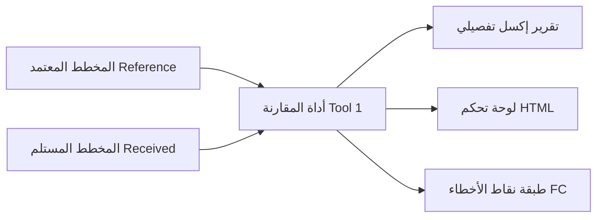
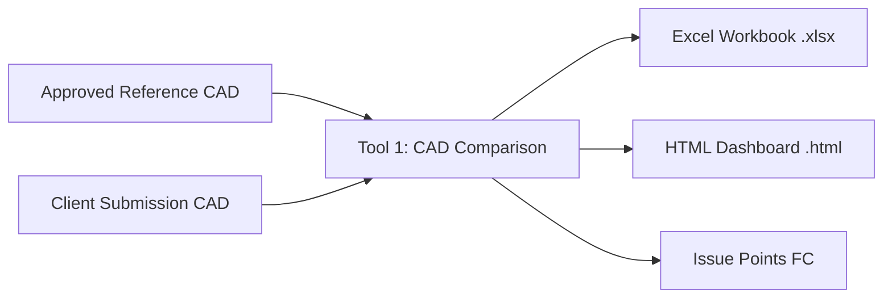

# CAD Standards & Layer QC Analyzer — Official User Guide
# دليل المستخدم الشامل لأداة فحص ومطابقة معايير الكاد وضبط الجودة الطبولوجية

---

## 📑 Table of Contents / الفهرس

- [🇸🇦 دليل المستخدم باللغة العربية (Arabic User Guide)](#-دليل-المستخدم-باللغة-العربية)
  - [1. مقدمة الدليل والهدف منه](#1-مقدمة-الدليل-والهدف-منه)
  - [2. المتطلبات وطريقة التثبيت في ArcGIS Pro](#2-المتطلبات-وطريقة-التثبيت-في-arcgis-pro)
  - [3. سيناريوهات الاستخدام خطوة بخطوة](#3-سيناريوهات-الاستخدام-خطوة-بخطوة)
    - [السيناريو الأول: فحص ومقارنة مخطط الكاد مع المخطط المعتمد (Tool 1)](#السيناريو-الأول-فحص-ومقارنة-مخطط-الكاد-مع-المخطط-المعتمد-tool-1)
    - [السيناريو الثاني: الفحص الهندسي والطبولوجي التلقائي للطبقات (Tool 2)](#السيناريو-الثاني-الفحص-الهندسي-والطبولوجي-التلقائي-للطبقات-tool-2)
  - [4. كيفية قراءة وتفسير التقارير الناتجة](#4-كيفية-قراءة-وتفسير-التقارير-الناتجة)
    - [لوحة التحكم التفاعلية (HTML Dashboard)](#1-لوحة-التحكم-التفاعلية-html-dashboard)
    - [شيتات تقرير الإكسل (Excel Workbook)](#2-شيتات-تقرير-الإكسل-excel-workbook)
    - [طبقة النقاط الجغرافية في خريطة ArcGIS Pro (Issue Feature Class)](#3-طبقة-النقاط-الجغرافية-في-خريطة-arcgis-pro-issue-feature-class)
  - [5. دليل تصحيح الأخطاء في AutoCAD و ArcGIS Pro](#5-دليل-تصحيح-الأخطاء-في-autocad-و-arcgis-pro)
  - [6. الأسئلة الشائعة (FAQ)](#6-الأسئلة-الشائعة-faq)
- [🇬🇧 English User Guide](#-english-user-guide)
  - [1. Introduction & Purpose](#1-introduction--purpose)
  - [2. Prerequisites & ArcGIS Pro Installation](#2-prerequisites--arcgis-pro-installation)
  - [3. Step-by-Step Practical Scenarios](#3-step-by-step-practical-scenarios)
    - [Scenario A: Reference-Based CAD Comparison QC (Tool 1)](#scenario-a-reference-based-cad-comparison-qc-tool-1)
    - [Scenario B: Automated Per-Layer Geometry & Topology QC (Tool 2)](#scenario-b-automated-per-layer-geometry--topology-qc-tool-2)
  - [4. Interpreting Results & Deliverables](#4-interpreting-results--deliverables)
    - [Interactive HTML Dashboard](#1-interactive-html-dashboard)
    - [Excel Multi-Sheet Workbook](#2-excel-multi-sheet-workbook)
    - [ArcGIS Pro Issue Feature Class](#3-arcgis-pro-issue-feature-class)
  - [5. Remediation Guide: Fixing Issues in AutoCAD & GIS](#5-remediation-guide-fixing-issues-in-autocad--gis)
  - [6. Frequently Asked Questions (FAQ)](#6-frequently-asked-questions-faq)

---

# 🇸🇦 دليل المستخدم باللغة العربية

---

## 1. مقدمة الدليل والهدف منه

مرحباً بك في **دليل المستخدم الرسمي** لأداة **CAD Standards & Layer QC Analyzer**.  
صُممت هذه الأداة خصيصاً لمساعدة مهندسي التخطيط العمراني، والمساحة، وأخصائيي نظم المعلومات الجغرافية (GIS) ومديري ضبط الجودة (QA/QC) على أتمتة مراجعة ملفات الكاد واعتمادها بسرعة ودقة فائقة وبدون أي تدخل يدوي.

### متى تستخدم هذه الأداة؟
1. **عند استلام مخطط معدل من مكتب استشاري أو مطور عقاري**: وتريد التأكد فوراً هل التزم بنفس الطبقات والمعايير المعتمدة أم قام بالتعديل عليها؟
2. **قبل تسليم المخططات أو إدخالها إلى قواعد البيانات الجغرافية (Enterprise Geodatabase)**: للتحقق من عدم وجود تداخلات، أو فراغات، أو أخطاء إغلاق، أو أضلاع قصيرة.
3. **لضمان الالتزام بمعايير الطبقات ونظافة الملف**: والتأكد التام من خلو الطبقة `0` وطبقة `Defpoints` من أي عناصر مرسومة.

---

## 2. المتطلبات وطريقة التثبيت في ArcGIS Pro

### المتطلبات الأساسية
- **البرنامج**: برنامج **ArcGIS Pro** (إصدار 3.0 فما فوق).
- **البيئة البرمجية**: بيئة بايثون الافتراضية المرفقة مع ArcGIS Pro (`arcgispro-py3`).
- **المكتبات**: جميع المكتبات المستخدمة (`arcpy` و `openpyxl`) مدمجة ومثبتة تلقائياً في ArcGIS Pro ولا تحتاج لتثبيت أي برامج خارجية.

### خطوات إضافة التول بوكس إلى ArcGIS Pro
1. افتح برنامج **ArcGIS Pro** وافتح مشروعك (`.aprx`).
2. انتقل إلى لوحة **Catalog Pane** (إذا لم تكن ظاهرة، افتحها من قائمة `View` $\rightarrow$ `Catalog Pane`).
3. اضغط بزر الفأرة الأيمن على مجلد **Toolboxes** واختر **Add Toolbox**.
4. تصفح المجلدات واختر ملف التول بوكس:
   ```text
   CAD_QC_Toolbox.pyt
   ```
5. سيظهر التول بوكس باسم **CAD Standards & Layer QC Toolbox** وبداخله أداتان:
   - 🔹 **CAD Reference-Based Comparison QC**: لمقارنة ملفين (معتمد ضد مستلم).
   - 🔹 **Geometry & Topology QC Analyzer**: للفحص الطبولوجي والهندسي التلقائي لكل طبقة.

---

## 3. سيناريوهات الاستخدام خطوة بخطوة

---

### السيناريو الأول: فحص ومقارنة مخطط الكاد مع المخطط المعتمد (`Tool 1`)

**الهدف**: لديك مخطط أصلي معتمد (`orig.dwg`) واستلمت مخططاً معدلاً (`edited.dwg`) وتريد تقريراً يوضح ما الذي تغير بينهما.



#### خطوات التشغيل:
1. انقر نقراً مزدوجاً على أداة **`CAD Reference-Based Comparison QC`**.
2. في خانة **Reference CAD / Approved Dataset**:
   - اضغط على زر التصفح واختر الملف المعتمد (مثل `orig.dwg`).
3. في خانة **Received CAD / Client Dataset**:
   - اضغط على زر التصفح واختر الملف المستلم (مثل `edited.dwg`).
4. خانة **Comparison Scope**:
   - اتركها `All Layers` لمقارنة جميع الطبقات، أو اختر `Polygon / Closed-Geometry Layers` إذا كنت مهتماً فقط بطبقات الأراضي والمضلعات.
5. في خانة **Output Folder for Reports**:
   - حدد مجلداً على جهازك لحفظ التقارير (مثلاً `D:\QC_Reports`).
6. **الخيارات الإضافية (Comparison Options)**:
   - جميع الخيارات مفعلة افتراضياً (`Compare Feature Counts`, `Compare Geometries`, `Compare Closure`, `Compare Colors`, إلخ).
   - إذا كنت ترغب في تشغيل الفحص الطبولوجي والهندسي الشامل على المخطط المستلم أيضاً، قم بتفعيل خيار **`Run Geometry QC on Received CAD (Combined Workflow)`**.
7. اضغط على زر **Run** في أسفل اللوحة.

---

### السيناريو الثاني: الفحص الهندسي والطبولوجي التلقائي للطبقات (`Tool 2`)

**الهدف**: لديك مخطط كاد يحتوي على طبقات متنوعة (`parcel`, `roud`, `boundary`) وتريد فحص كل طبقة على حدة واكتشاف التداخلات، والفجوات، والرؤوس الزائدة، وعدم الإغلاق.

#### خطوات التشغيل:
1. انقر نقراً مزدوجاً على أداة **`Geometry & Topology QC Analyzer`**.
2. في خانة **Input Feature Class / CAD Drawing**:
   - اختر ملف الكاد مباشرة (مثل `edited.dwg`) أو اختر طبقة من الخريطة (مثل `Polyline` أو `Polygon`).
3. في خانة **CAD Layer Field (Optional)**:
   - اتركها فارغة؛ ستقوم الأداة باكتشاف حقل الطبقة (`Layer`) تلقائياً.
4. في خانة **Target CAD Layer**:
   - **الخيار الموصى به**: اتركه **`All Layers`** لتقوم الأداة تلقائياً بتقسيم الرسمة وفحص كل طبقة كاد بشكل مستقل.
   - أو يمكنك اختيار طبقة معينة من القائمة المنسدلة (مثل طبقة `parcel` فقط).
5. في خانة **Output Folder for Reports**:
   - حدد المجلد المخصص لحفظ التقارير.
6. في خانة **Output Issue Feature Class (Optional)**:
   - إذا كنت تريد إسقاط الأخطاء كنقاط جغرافية على الخريطة، حدد مسار Feature Class داخل الجيوداتابيز الخاصة بمشروعك (مثلاً: `C:\MyProject\Default.gdb\QC_Issues_Points`).
7. اضغط على **Run**.

---

## 4. كيفية قراءة وتفسير التقارير الناتجة

بمجرد انتهاء الأداة، ستجد داخل مجلد المخرجات ملفات بالصيغ التالية:

### 1. لوحة التحكم التفاعلية (`HTML Dashboard`)
- **الملف**: `Geometry_QC_Report_YYYYMMDD_HHMMSS.html` أو `CAD_QC_Report_YYYYMMDD_HHMMSS.html`.
- **طريقة الفتح**: انقر عليه نقراً مزدوجاً ليفتح في أي متصفح إنترنت (Chrome, Edge, Firefox).
- **أهم المحتويات**:
  - **بطاقات الأداء (KPI Cards)**: إجمالي الأخطاء الحرجة (`Errors`)، والتحذيرات (`Warnings`)، ونسبة نجاح الطبقات.
  - **جدول تفصيل الأخطاء لكل طبقة (Geometry QC — Issues Breakdown by CAD Layer)**:
    - يوضح اسم كل طبقة، وعدد عناصرها، وكم خطأ تم اكتشافه فيها، وحالتها النهائية (`PASS` أو `ERROR`).
  - **أزرار الفلترة**: يمكنك الضغط على زر `Errors` لعرض الطبقات أو المشكلات المعيبة فقط.
  - **سجل الأخطاء التفصيلي (Issues Registry)**: يعرض رقم كل عنصر معيب (`OID`)، ونوع العيب، وإحداثيات موقعه بدقة $(X, Y)$.

---

### 2. شيتات تقرير الإكسل (`Excel Workbook`)
- **الملف**: بصيغة `.xlsx`.
- يحتوي التقرير على أوراق عمل متعددة مجهزة للطباعة والمشاركة مع الاستشاري:
  1. **`Summary`**: نظرة عامة شاملة وتاريخ الفحص ونظام الإحداثيات المستخدم.
  2. **`Layer Overview`**: جدول مقارنة الطبقات بالشارات الملونة (الأخضر للناجح، الأحمر للخطأ، الأزرق للطبقات الإضافية، والبرتقالي للتحذيرات).
  3. **`Geometry QC Summary`**: جدول يلخص نتائج الفحوصات العشرة وجدول يوضح تفصيل الأخطاء لكل طبقة كاد.
  4. **`Geometry QC Issues`**: قائمة كاملة بكل خطأ وعمود يوضح اسم الـ **CAD Layer** ورقم العنصر $(X, Y)$ ليسهل على الرسام الهندسي العثور عليه.

---

### 3. تصدير الأخطاء العشرة في Feature Dataset داخل قاعدة البيانات الافتراضية (Default.gdb)
- **الموقع الافتراضي**: يتم حفظ النتائج تلقائياً في قاعدة البيانات الافتراضية لمشروعك في ArcGIS Pro (`Default.gdb`) داخل **Feature Dataset** مخصص باسم:
  `CAD_Geometry_QC_Errors` (أو داخل أي Geodatabase تختارها).
- **تنظيم الأخطاء العشرة في طبقات مستقلة**:
  لكل فحص من الفحوصات الهندسية العشرة، يتم إنشاء طبقة Feature Class مستقلة داخل الـ Dataset لتسهيل التصفح والتحكم في إظهار وإخفاء كل نوع خطأ:
  1. `QC01_Invalid_Geometries`: الأشكال الهندسية غير الصالحة، التقاطعات الذاتية، والإحداثيات الشاذة (NaN).
  2. `QC02_Overlaps`: تداخلات المضلعات مع إحداثيات ومساحة التداخل الدقيقة بالمتر المربع.
  3. `QC03_Duplicate_Geometries`: العناصر والعقد المتطابقة تماماً فوق بعضها.
  4. `QC04_Enclosed_Gaps`: الفجوات والفراغات المغلقة بين قطع الأراضي والمباني.
  5. `QC05_Multipart_Features`: العناصر متعددة الأجزاء غير المتصلة.
  6. `QC06_Short_Segments`: الأضلاع القصيرة جداً الميكرونية الأقل من حد التسامح.
  7. `QC07_Sharp_Angles`: الزوايا الحادة والارتدادات العكسية.
  8. `QC08_Snap_Issues`: النهايات السائبة وعدم الالتقاط التام (Undershoots / Overshoots).
  9. `QC09_Redundant_Vertices`: العقد الزائدة الواقعة على خط مستقيم واحد دون تغيير في الاتجاه.
  10. `QC10_Missing_Junctions`: التقاطعات المفقودة عند تلاقي شبكات الطرق دون وجود عقدة (Node).
  - **طبقة شاملة (`QC_All_Errors`)**: تضم جميع الأخطاء المكتشفة مع تصنيفها اللوني حسب نوع الخطأ ودرجة خطورته.
  - **طبقة طبقة الصفر (`QC11_Reserved_Layer_0`)**: تُنشأ إذا احتوت الطبقة المحجوزة `0` على أي عناصر مرسومة.
- **الإضافة التلقائية للخريطة (Add to Map)**:
  الطبقات التي تحتوي على أخطاء تُضاف فوراً وتلقائياً إلى خريطة ArcGIS Pro النشطة، مما يتيح لك عمل Zoom مباشر على الخطأ وتعديله أو توجيهه.

---

## 5. دليل تصحيح الأخطاء في AutoCAD و ArcGIS Pro

يوضح الجدول التالي أكثر الأخطاء شيوعاً وكيفية معالجتها برمجياً أو يدوياً:

| رمز الخطأ في التقرير | نوع المشكلة | الحل في AutoCAD / Civil 3D | الحل في ArcGIS Pro |
| :--- | :--- | :--- | :--- |
| `CHK_RESERVED_LAYER` | وجود عناصر في الطبقة `0` | حدد العناصر وانقلها لطبقتها المخصصة، واجعل الطبقة `0` فارغة تماماً. | استخدم أداة `Calculate Field` لتعديل حقل `Layer`. |
| `CHK_DUPLICATE` | عناصر مكررة فوق بعضها | اكتب الأمر `OVERKILL` لحذف العناصر المتطابقة تماماً. | استخدم أداة `Delete Identical`. |
| `CHK_CLOSURE` | خط بولي لاين غير مغلق | اكتب الأمر `PEDIT` $\rightarrow$ اختر الخط $\rightarrow$ اضغط `Close`. | استخدم أداة `Extend Line` أو `Snap`. |
| `CHK_OVERLAP` | تداخل بين قطعتي أرض | اضغط على الخط المتداخل وقم بتعديل العقد ليتطابق الحدان دون ركوب. | استخدم شريط `Edit` $\rightarrow$ خيار `Clip` أو `Planarize`. |
| `CHK_GAP` | فجوة صغيرة بين المضلعات | استخدم أمر `EXTEND` أو أمر `TRIM` لإلغاء الفراغ بين الأضلاع. | استخدم `Align Features` لغلق الفجوة. |
| `CHK_SHORT_SEG` | ضلع قصير جداً (أقل من 10 سم) | احذف النقطة الزائدة المتقاربة عبر أمر `PEDIT` $\rightarrow$ `Edit Vertex`. | استخدم أداة `Simplify Polygon` أو `Generalize`. |
| `CHK_SNAP` | خط غير واصل (Undershoot/Overshoot) | قم بتفعيل `OSNAP` واسحب نقطة نهاية الخط حتى تلتصق تماماً بالعقدة المقابلة. | استخدم بيئة الـ Snapping في شريط التعديل. |

---

## 6. الأسئلة الشائعة (FAQ)

#### س1: هل تعدل الأداة أي بيانات في ملف الكاد الأصلي؟
> **ج**: **مستحيل**. الأداة مصممة بفلسفة **Strictly Read-Only**، حيث تقرأ البيانات فقط باستخدام Cursors مؤقتة في الذاكرة دون فتح الملف للكتابة، وبالتالي تظل ملفاتك آمنة بنسبة 100%.

#### س2: ماذا أفعل إذا كان المخطط المرجعي به عناصر في Layer 0؟
> **ج**: ستظهر الأداة تحذيراً (`WARNING`) بأن المخطط المرجعي نفسه يحتوي على بيانات في الطبقة `0` ويخالف المعايير. وإذا قام العميل بحذفها في المخطط المستلم، ستعتبر الأداة المخطط المستلم ناجحاً في هذه النقطة.

#### س3: هل تدعم الأداة ملفات الـ DXF وكذلك ملفات Shapefile و File Geodatabase؟
> **ج**: نعم، الأداة تدعم ملفات `.dwg` و `.dxf` بالإضافة إلى أي Feature Class أو Shapefile أو Layer موجود في خريطة ArcGIS Pro.

---

# 🇬🇧 English User Guide

---

## 1. Introduction & Purpose

Welcome to the official **CAD Standards & Layer QC Analyzer User Guide**.  
This toolbox is specifically engineered for civil engineers, urban planners, GIS analysts, and survey QA/QC specialists to automate CAD compliance checking, quality assurance, and topological verification.

### When Should You Use This Toolbox?
1. **Upon Receiving Consultant CAD Submissions**: Instant verification that submitted drawings strictly follow the approved reference baseline without unauthorized layer, color, or geometry modifications.
2. **Prior to GIS Migration**: Ensuring CAD boundaries are 100% topologically clean (no overlaps, gaps, or closure defects) before loading into an Enterprise Geodatabase.
3. **Drafting Standards Enforcement**: Guaranteeing that reserved layers such as Layer `0` and `Defpoints` remain strictly empty.

---

## 2. Prerequisites & ArcGIS Pro Installation

### Prerequisites
- **Software**: **ArcGIS Pro** version 3.0 or higher (compatible with ArcGIS Pro 3.3).
- **Environment**: Default ArcGIS Pro Python environment (`arcgispro-py3`).
- **Dependencies**: Built-in libraries (`arcpy`, `openpyxl`). No external pip or conda installations required.

### Adding the Toolbox to ArcGIS Pro
1. Open your project in **ArcGIS Pro**.
2. Open the **Catalog Pane** (`View` tab $\rightarrow$ `Catalog Pane`).
3. Right-click the **Toolboxes** folder and select **Add Toolbox**.
4. Browse to the directory and select:
   ```text
   CAD_QC_Toolbox.pyt
   ```
5. The toolbox **CAD Standards & Layer QC Toolbox** will appear containing two production tools:
   - 🔹 **CAD Reference-Based Comparison QC**: Baseline vs Received comparison.
   - 🔹 **Geometry & Topology QC Analyzer**: Autonomous 10-check per-layer geometry inspection.

---

## 3. Step-by-Step Practical Scenarios

---

### Scenario A: Reference-Based CAD Comparison QC (`Tool 1`)

**Goal**: Compare an approved master plan (`orig.dwg`) against a newly submitted update (`edited.dwg`) and pinpoint all variances.



#### Execution Steps:
1. Double-click **`CAD Reference-Based Comparison QC`**.
2. In **Reference CAD / Approved Dataset**: Browse to the approved baseline CAD (e.g. `orig.dwg`).
3. In **Received CAD / Client Dataset**: Browse to the submitted CAD (e.g. `edited.dwg`).
4. In **Comparison Scope**: Keep `All Layers` (or select `Polygon / Closed-Geometry Layers` to focus exclusively on parcel boundaries).
5. In **Output Folder for Reports**: Choose your report output folder (e.g. `D:\CAD_QC_Reports`).
6. **Optional Combined Workflow**:
   - Check **`Run Geometry QC on Received CAD (Combined Workflow)`** to run the full 10 topology checks on the client drawing alongside the reference comparison.
7. Click **Run**.

---

### Scenario B: Automated Per-Layer Geometry & Topology QC (`Tool 2`)

**Goal**: Validate any CAD drawing (`.dwg`, `.dxf`) or GIS layer for topological integrity, ensuring roads, lots, and setbacks are checked independently.

#### Execution Steps:
1. Double-click **`Geometry & Topology QC Analyzer`**.
2. In **Input Feature Class / CAD Drawing**: Select your CAD file (e.g. `edited.dwg`) or a map layer.
3. In **CAD Layer Field (Optional)**: Leave blank; the tool auto-detects fields like `Layer`, `LAYER`, or `CadLayer`.
4. In **Target CAD Layer**:
   - Keep default **`All Layers`** to automatically partition and evaluate every CAD layer present in the file.
   - Or pick a single layer (e.g. `parcel`) from the dynamic dropdown.
5. In **Output Folder for Reports**: Select where to store reports.
6. In **Output Issue Feature Class (Optional)**: Select an output geodatabase feature class (e.g. `D:\Data\Project.gdb\QC_Issue_Points`).
7. Click **Run**.

---

## 4. Interpreting Results & Deliverables

After execution, the following deliverable package is saved in your output directory:

### 1. Interactive HTML Dashboard
- **File**: `Geometry_QC_Report_YYYYMMDD_HHMMSS.html` or `CAD_QC_Report_...html`.
- Double-click to open in any modern browser (Chrome, Edge, Safari).
- **Key Features**:
  - **KPI Cards**: Summary of total errors, warnings, and compliant layers.
  - **Geometry QC Breakdown by CAD Layer**: Dedicated table listing each CAD layer, feature counts, error counts, warning counts, and compliance badges.
  - **Interactive Filter Buttons**: Filter by `Errors`, `Warnings`, or `Passed`.
  - **Issues Registry**: Detailed table of every detected defect with exact $(X, Y)$ coordinate locations and feature IDs.

---

### 2. Excel Multi-Sheet Workbook
- **File**: `.xlsx` workbook styled with official corporate palettes.
- **Sheets Included**:
  - `Summary`: Executive overview and coordinate reference metadata.
  - `Layer Overview`: Complete matrix of layers with `PASS`, `ERROR`, or `WARNING` status.
  - `Geometry QC Summary`: 10-check summary and **Issues Breakdown by CAD Layer**.
  - `Geometry QC Issues`: Tabular defect log including the dedicated **CAD Layer** column for rapid assignment to CAD draftspersons.

---

### 3. Geodatabase Feature Dataset with 10 Dedicated Error Layers (`Default.gdb`)
- **Default Storage**: Defects are automatically exported to a dedicated **Feature Dataset** named `CAD_Geometry_QC_Errors` inside your project's active `Default.gdb` (or custom workspace).
- **10 Dedicated Error Classes**:
  Each of the 10 geometry defect checks receives its own distinct Feature Class inside the dataset for granular layer control and symbology:
  1. `QC01_Invalid_Geometries`: Invalid geometries, bow-ties, self-intersections, and NaN coordinates.
  2. `QC02_Overlaps`: Polygon overlapping areas with precise $(X, Y)$ centroids and overlap area in $m^2$.
  3. `QC03_Duplicate_Geometries`: Duplicate/coincident features and vertices.
  4. `QC04_Enclosed_Gaps`: Enclosed slivers and void gaps between adjacent parcels and buildings.
  5. `QC05_Multipart_Features`: Disjoint multipart geometry components.
  6. `QC06_Short_Segments`: Sub-tolerance micro-edges ($< 10$ cm).
  7. `QC07_Sharp_Angles`: Sharp kickbacks and acute angles ($< 5^\circ$).
  8. `QC08_Snap_Issues`: Undershoots and overshoots failing vertex connectivity ($< 1$ cm).
  9. `QC09_Redundant_Vertices`: Superfluous collinear vertices along straight lines.
  10. `QC10_Missing_Junctions`: Intersecting network lines lacking connection nodes.
  - **Master Combined Layer (`QC_All_Errors`)**: Consolidates all defect markers with standardized attributes.
  - **Reserved Layer Layer (`QC11_Reserved_Layer_0`)**: Populated whenever AutoCAD system Layer `0` contains entities.
- **Automatic Map Loading**:
  When run within ArcGIS Pro, layers containing issues are **automatically added to your active Map view** for instant visual inspection, selection, and direct remediation.

---

## 5. Remediation Guide: Fixing Issues in AutoCAD & GIS

| Check ID | Issue Description | Fix in AutoCAD / Civil 3D | Fix in ArcGIS Pro |
| :--- | :--- | :--- | :--- |
| `CHK_RESERVED_LAYER` | Data found on Layer `0` | Select entities on layer `0`, reassign them to proper domain layers, leave Layer `0` completely empty. | Use `Calculate Field` to reassign the `Layer` attribute. |
| `CHK_DUPLICATE` | 100% coincident duplicates | Run the `OVERKILL` command with duplicate geometry options enabled. | Use the `Delete Identical` geoprocessing tool. |
| `CHK_CLOSURE` | Polyline endpoint gap | Run `PEDIT` $\rightarrow$ select polyline $\rightarrow$ choose `Close`. | Use `Snap` or `Extend Line` tool. |
| `CHK_OVERLAP` | Overlapping parcel polygons | Move vertices using Osnap so boundaries touch without overlap. | Use the `Clip` or `Planarize` editing tools. |
| `CHK_GAP` | Sliver void between parcels | Adjust boundaries with `EXTEND` or `TRIM` to close interior gaps. | Use `Align Features` with gap closure tolerance. |
| `CHK_SHORT_SEG` | Microscopic edge ($< 10$ cm) | Delete superfluous vertices using `PEDIT` $\rightarrow$ `Edit Vertex`. | Run `Simplify Polygon` or `Generalize`. |
| `CHK_SNAP` | Undershoot or overshoot | Enable `OSNAP` and snap the endpoint directly to the target vertex. | Turn on snapping in the Pro Edit ribbon and align vertices. |

---

## 6. Frequently Asked Questions (FAQ)

#### Q1: Does the tool modify or overwrite my source CAD file?
> **A**: **Never**. The tool operates strictly **100% read-only**. It uses search cursors to stream features into memory and never executes write or edit transactions on input drawings.

#### Q2: What happens if the Reference CAD has entities on Layer 0?
> **A**: The tool generates a `WARNING` indicating that the Reference baseline itself violates standard CAD guidelines. If the client drawing purged Layer `0`, the tool rewards this as compliant (`PASS`).

#### Q3: Can I run this tool on a File Geodatabase feature class or Shapefile?
> **A**: Yes. The tool supports `.dwg`, `.dxf`, File Geodatabase feature classes, Enterprise SDE layers, and Shapefiles.
