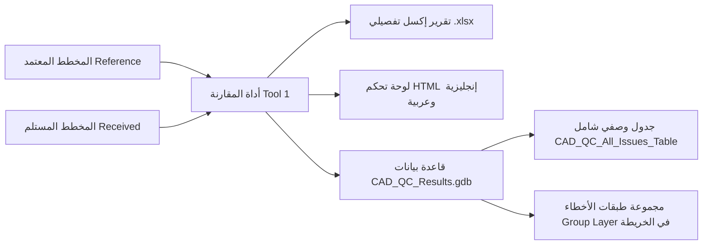
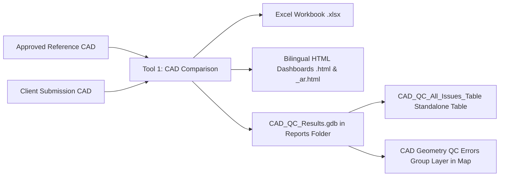

# CAD Standards & Layer QC Analyzer — Official User Guide
# دليل المستخدم الشامل لأداة فحص ومطابقة معايير الكاد وضبط الجودة الطبولوجية

---

## 📑 Table of Contents / الفهرس

- [🇸🇦 دليل المستخدم باللغة العربية (Arabic User Guide)](#-دليل-المستخدم-باللغة-العربية)
  - [1. مقدمة الدليل والهدف منه](#1-مقدمة-الدليل-والهدف-منه)
  - [2. المتطلبات وطريقة التثبيت في ArcGIS Pro](#2-المتطلبات-وطريقة-التثبيت-في-arcgis-pro)
  - [3. سيناريوهات الاستخدام خطوة بخطوة](#3-سيناريوهات-الاستخدام-خطوة-بخطوة)
    - [السيناريو الأول: فحص ومقارنة مخطط الكاد مع المخطط المعتمد (Tool 1)](#السيناريو-الأول-فحص-ومقارنة-مخطط-الكاد-مع-المخطط-المعتمد-tool-1)
    - [السيناريو الثاني: الفحص الهندسي والطبولوجي التلقائي للطبقات (Tool 2)](#السيناريو-الثاني-الفحص-الهندسي-والطبولوجي-التلقائي-للطبقات-tool-2)
  - [4. كيفية قراءة وتفسير التقارير الناتجة والمخرجات](#4-كيفية-قراءة-وتفسير-التقارير-الناتجة-والمخرجات)
    - [لوحة التحكم التفاعلية ثنائية اللغة (Bilingual HTML Dashboard)](#1-لوحة-التحكم-التفاعلية-ثنائية-اللغة-bilingual-html-dashboard)
    - [شيتات تقرير الإكسل (Excel Workbook)](#2-شيتات-تقرير-الإكسل-excel-workbook)
    - [قاعدة بيانات النتائج ومجموعة الطبقات في الخريطة (CAD_QC_Results.gdb & Group Layer)](#3-قاعدة-بيانات-النتائج-ومجموعة-الطبقات-في-الخريطة-cad_qc_resultsgdb--group-layer)
    - [التقرير النصي السريع (Text Summary)](#4-التقرير-النصي-السريع-text-summary)
  - [5. دليل تصحيح الأخطاء في AutoCAD و ArcGIS Pro](#5-دليل-تصحيح-الأخطاء-في-autocad-و-arcgis-pro)
  - [6. الأسئلة الشائعة (FAQ)](#6-الأسئلة-الشائعة-faq)
- [🇬🇧 English User Guide](#-english-user-guide)
  - [1. Introduction & Purpose](#1-introduction--purpose)
  - [2. Prerequisites & ArcGIS Pro Installation](#2-prerequisites--arcgis-pro-installation)
  - [3. Step-by-Step Practical Scenarios](#3-step-by-step-practical-scenarios)
    - [Scenario A: Reference-Based CAD Comparison QC (Tool 1)](#scenario-a-reference-based-cad-comparison-qc-tool-1)
    - [Scenario B: Automated Per-Layer Geometry & Topology QC (Tool 2)](#scenario-b-automated-per-layer-geometry--topology-qc-tool-2)
  - [4. Interpreting Results & Deliverables](#4-interpreting-results--deliverables)
    - [Dual-Language Interactive HTML Dashboard](#1-dual-language-interactive-html-dashboard)
    - [Excel Multi-Sheet Workbook](#2-excel-multi-sheet-workbook)
    - [Dedicated Geodatabase, Standalone Table & Group Layer (CAD_QC_Results.gdb)](#3-dedicated-geodatabase-standalone-table--group-layer-cad_qc_resultsgdb)
    - [Text Summary Log](#4-text-summary-log)
  - [5. Remediation Guide: Fixing Issues in AutoCAD & GIS](#5-remediation-guide-fixing-issues-in-autocad--gis)
  - [6. Frequently Asked Questions (FAQ)](#6-frequently-asked-questions-faq)

---

# 🇸🇦 دليل المستخدم باللغة العربية

---

## 1. مقدمة الدليل والهدف منه

مرحباً بك في **دليل المستخدم الرسمي** لأداة **CAD Standards & Layer QC Analyzer**.  
صُممت هذه الأداة خصيصاً لمساعدة مهندسي التخطيط العمراني، والمساحة، وأخصائيي نظم المعلومات الجغرافية (GIS) ومديري ضبط الجودة (QA/QC) على أتمتة مراجعة ملفات الكاد واعتمادها بسرعة ودقة فائقة وبدون أي تدخل يدوي.

### متى تستخدم هذه الأداة؟
1. **عند استلام مخطط معدل من مكتب استشاري أو مطور عقاري**: وتريد التأكد فوراً هل التزم بنفس الطبقات والمعايير المعتمدة أم قام بالتعديل عليها؟
2. **قبل تسليم المخططات أو إدخالها إلى قواعد البيانات الجغرافية (Enterprise Geodatabase)**: للتحقق من عدم وجود تداخلات، أو فراغات، أو أخطاء إغلاق، أو أضلاع قصيرة.
3. **لضمان الالتزام بمعايير الطبقات ونظافة الملف**: والتأكد التام من خلو الطبقة `0` وطبقة `Defpoints` من أي عناصر مرسومة.

---

## 2. المتطلبات وطريقة التثبيت في ArcGIS Pro

### المتطلبات الأساسية
- **البرنامج**: برنامج **ArcGIS Pro** (إصدار 3.0 فما فوق، متوافق ومختبر على 3.3).
- **البيئة البرمجية**: بيئة بايثون الافتراضية المرفقة مع ArcGIS Pro (`arcgispro-py3`).
- **المكتبات**: جميع المكتبات المستخدمة (`arcpy` و `openpyxl`) مدمجة ومثبتة تلقائياً في ArcGIS Pro ولا تحتاج لتثبيت أي برامج خارجية.

### خطوات إضافة التول بوكس إلى ArcGIS Pro
1. افتح برنامج **ArcGIS Pro** وافتح مشروعك (`.aprx`).
2. انتقل إلى لوحة **Catalog Pane** (إذا لم تكن ظاهرة، افتحها من قائمة `View` $\rightarrow$ `Catalog Pane`).
3. اضغط بزر الفأرة الأيمن على مجلد **Toolboxes** واختر **Add Toolbox**.
4. تصفح المجلدات واختر ملف التول بوكس:
   ```text
   CAD_QC_Toolbox.pyt
   ```
5. سيظهر التول بوكس باسم **CAD Standards & Layer QC Toolbox** وبداخله أداتان:
   - 🔹 **CAD Reference-Based Comparison QC**: لمقارنة ملفين (معتمد ضد مستلم) وتشغيل الفحص الهندسي المدمج.
   - 🔹 **Geometry & Topology QC Analyzer**: للفحص الطبولوجي والهندسي التلقائي لكل طبقة كاد بمجموعات الفحص المتخصصة (Polygon, Line, Point).

---

## 3. سيناريوهات الاستخدام خطوة بخطوة

---

### السيناريو الأول: فحص ومقارنة مخطط الكاد مع المخطط المعتمد (`Tool 1`)

**الهدف**: لديك مخطط أصلي معتمد (`orig.dwg`) واستلمت مخططاً معدلاً (`edited.dwg`) وتريد تقريراً شاملاً يوضح ما الذي تغير بينهما مع التحقق من سلامة الأشكال هندسياً.



#### خطوات التشغيل:
1. انقر نقراً مزدوجاً على أداة **`CAD Reference-Based Comparison QC`**.
2. في خانة **Reference CAD / Approved Dataset**:
   - اضغط على زر التصفح واختر الملف المعتمد (مثل `orig.dwg`).
3. في خانة **Received CAD / Client Dataset**:
   - اضغط على زر التصفح واختر الملف المستلم (مثل `edited.dwg`).
4. خانة **Comparison Scope**:
   - اتركها `All Layers` لمقارنة جميع الطبقات، أو اختر `Polygon / Closed-Geometry Layers` إذا كنت مهتماً فقط بطبقات الأراضي والمضلعات.
5. في خانة **Output Folder for Reports**:
   - حدد مجلداً على جهازك لحفظ التقارير (مثلاً `D:\QC_Reports`). سيتم إنشاء التقارير وقاعدة البيانات `CAD_QC_Results.gdb` داخله مباشرة.
6. **الخيارات الإضافية (Comparison Options)**:
   - خيار **`Compare Feature Counts`**: تم ضبطه افتراضياً على `False` ليركز الفحص حصراً على المعايير وجودة الرسم دون إطلاق أخطاء وهمية لمجرد اختلاف أعداد العناصر.
   - خيارات الهندسة والخصائص: مفعلة افتراضياً (`Compare Geometries`, `Compare Closure`, `Compare Colors`, إلخ).
   - خيار **`Run Geometry QC on Received CAD (Combined Workflow)`**: فعّله لتشغيل الفحص الطبولوجي والهندسي الشامل على المخطط المستلم وتصدير طبقات الأخطاء المكانية.
7. خانة **Output Standalone Issues Table (Optional)**:
   - اختياري؛ لتحديد مسار جدول بيانات وصفي مخصص (مبني كـ Standalone Table بدون حقل Shape وهمي).
8. اضغط على زر **Run** في أسفل اللوحة.

---

### السيناريو الثاني: الفحص الهندسي والطبولوجي التلقائي للطبقات (`Tool 2`)

**الهدف**: لديك مخطط كاد يحتوي على طبقات متنوعة (`parcel`, `road`, `boundary`, `points`) وتريد فحص كل طبقة على حدة وفقاً لنوعها الهندسي (مضلعات، خطوط، نقاط) واكتشاف التداخلات، والفجوات، والرؤوس الزائدة، وعدم الإغلاق.

#### خطوات التشغيل:
1. انقر نقراً مزدوجاً على أداة **`Geometry & Topology QC Analyzer`**.
2. في خانة **Input Feature Class / CAD Drawing**:
   - اختر ملف الكاد مباشرة (مثل `edited.dwg`) أو اختر طبقة من الخريطة (مثل `Polyline` أو `Polygon`).
3. في خانة **CAD Layer Field (Optional)**:
   - اتركها فارغة؛ ستقوم الأداة باكتشاف حقل الطبقة (`Layer`) تلقائياً.
4. في خانة **Target CAD Layer**:
   - **الخيار الموصى به**: اتركه **`All Layers`** لتقوم الأداة تلقائياً بتقسيم الرسمة وفحص كل طبقة كاد بشكل مستقل بناءً على البروفايل الهندسي المناسب لها:
     - طبقات المضلعات: فحص التداخلات، الفجوات، الرؤوس الزائدة، عدم الإغلاق (`UNCLOSED_RING`).
     - طبقات الخطوط: فحص الخطوط المفككة، التقاطعات الذاتية، النهايات السائبة (Dangles).
     - طبقات النقاط: فحص النقاط الفارغة والنقاط المكررة والمتكدسة.
5. في خانة **Output Folder for Reports**:
   - حدد المجلد المخصص لحفظ التقارير وقاعدة البيانات الناتجة.
6. في خانة **Output Standalone Issues Table (Optional)**:
   - مسار اختياري لجدول الأخطاء الوصفي.
7. اضغط على **Run**.

---

## 4. كيفية قراءة وتفسير التقارير الناتجة والمخرجات

بمجرد انتهاء الأداة، ستجد داخل مجلد المخرجات حزمة متكاملة منظمة كالتالي:

```text
Output Folder/
├── CAD_QC_Report_YYYYMMDD_HHMMSS.html        # لوحة التحكم التفاعلية باللغة الإنجليزية (الأساسية)
├── CAD_QC_Report_YYYYMMDD_HHMMSS_ar.html     # لوحة التحكم التفاعلية باللغة العربية (RTL)
├── CAD_QC_Report_YYYYMMDD_HHMMSS.xlsx        # تقرير إكسل احترافي متعدد الأوراق
├── CAD_QC_Report_YYYYMMDD_HHMMSS.txt         # ملخص نصي سريع
└── CAD_QC_Results.gdb/                       # قاعدة بيانات جغرافية مخصصة للنتائج
    ├── CAD_QC_All_Issues_Table               # جدول وصفي لجميع الأخطاء (بدون Shape وهمي)
    └── CAD_Geometry_QC_Errors (Dataset)      # حاوية الطبقات الهندسية للأخطاء المكتشفة
        ├── QC01_Invalid_Geometries
        ├── QC02_Overlaps
        └── ... (تُنشأ فقط للفحوصات التي بها أخطاء)
```

---

### 1. لوحة التحكم التفاعلية ثنائية اللغة (`Bilingual HTML Dashboard`)
- **الملفات**:
  - `CAD_QC_Report_YYYYMMDD_HHMMSS.html` (النسخة الإنجليزية - الأساسية).
  - `CAD_QC_Report_YYYYMMDD_HHMMSS_ar.html` (النسخة العربية - واجهة RTL كاملة ومصطلحات هندسية معتمدة).
- **التبديل الفوري بين اللغتين**:
  يوجد في أعلى لوحة التحكم زر تفاعلي `🌐 العربية` أو `🌐 English` يتيح لك الانتقال الفوري بين التقريرين بنقرة واحدة دون الحاجة لإعادة توليد البيانات.
- **شبكة مؤشرات الأداء المتجاوبة (Responsive Auto-Fit KPI Grid)**:
  تم تصميم بطاقات الأداء بتقنية `grid-template-columns: repeat(auto-fit, minmax(100px, 1fr))` لتتمدد بسلاسة وتتراص في سطر واحد أنيق يناسب شاشات الحواسيب والأجهزة اللوحية دون هوامش فارغة.
- **أهم المحتويات**:
  - **بطاقات الأداء (KPIs)**: إجمالي الأخطاء الحرجة (`Errors`)، والتحذيرات (`Warnings`)، ونسبة الالتزام بالمعايير.
  - **جدول تفصيل الأخطاء لكل طبقة (Issues Breakdown by CAD Layer)**: يوضح اسم كل طبقة، ونوع هندستها، وعدد الأخطاء والتحذيرات فيها، وحالتها النهائية (`PASS` أو `ERROR`).
  - **أزرار الفلترة**: تصفية فورية لعرض الأخطاء فقط (`Errors`)، أو التحذيرات (`Warnings`)، أو الطبقات الناجحة (`Passed`).
  - **سجل الأخطاء التفصيلي (Issues Registry)**: يعرض أول 500 خطأ مع رقم العنصر (`OID`)، ونوع العيب، والإحداثيات الدقيقة $(X, Y)$.

---

### 2. شيتات تقرير الإكسل (`Excel Workbook`)
- **الملف**: بصيغة `.xlsx` منسق بمظهر احترافي بواسطة `openpyxl`.
- يحتوي التقرير على أوراق عمل متعددة مجهزة للطباعة والمشاركة مع الاستشاري:
  1. **`Summary`**: نظرة عامة شاملة وتاريخ الفحص ونظام الإحداثيات المستخدم وخلاصة النجاح/الفشل.
  2. **`Reference Profile`**: المعايير المستخلصة ديناميكياً من المخطط المرجعي المعتمد.
  3. **`Layer Overview`**: مصفوفة مطابقة الطبقات بالشارات الملونة (`PASS`, `ERROR`, `WARNING`, `MISSING`, `EXTRA`).
  4. **`Geometry QC Summary`**: جدول يلخص نتائج الفحوصات الهندسية وجدول يوضح تفصيل الأخطاء لكل طبقة كاد.
  5. **`Geometry QC Issues`**: قائمة كاملة بكل خطأ وعمود يوضح اسم الـ **CAD Layer** ورقم العنصر $(X, Y)$ ليسهل على الرسام الهندسي العثور عليه.
  6. **`Issue Details`**: جدول الأخطاء الشامل ببياناته القياسية.

---

### 3. قاعدة بيانات النتائج ومجموعة الطبقات في الخريطة (`CAD_QC_Results.gdb & Group Layer`)
- **موقع مستقل ونظيف**: يتم إنشاء قاعدة البيانات `CAD_QC_Results.gdb` تلقائياً داخل مجلد التقارير المحدد (`out_folder`)، مما يحافظ على نظافة قاعدة البيانات الافتراضية `Default.gdb` لمشروعك ويمنع تراكم الملفات.
- **فصل وصفي وهندسي ذكي (Dual-Format Architecture)**:
  1. **جدول وصفي شامل (`CAD_QC_All_Issues_Table`)**: جدول بيانات وصفي حقيقي (Standalone Table) يحتوي على جميع الأخطاء المكتشفة بدون هندسة مكانية وهمية (No Dummy Shape Point)، مع حفظ الإحداثيات $X, Y$ كأرقام وصفية.
  2. **طبقات مكانية مستقلة لكل خطأ (`Feature Classes`)**: داخل Feature Dataset مسمى `CAD_Geometry_QC_Errors`، يتم إنشاء طبقة مكانية مستقلة لكل نوع خطأ وُجدت له عناصر معيبة (مثل `QC01_Invalid_Geometries`, `QC02_Overlaps`... إلخ)، مع تجاوز الفحوصات الخالية من الأخطاء لتجنب الطبقات الفارغة.
- **التجميع التلقائي في الخريطة (Group Layer)**:
  عند فتح خريطة ArcGIS Pro وتشغيل الأداة، تُضاف جميع طبقات الأخطاء الهندسية تلقائياً داخل مجموعة طبقات منظمة باسم **`CAD Geometry QC Errors`** في لوحة المحتويات (Contents Pane)، بينما يُضاف الجدول الوصفي لقسم Standalone Tables، مما يوفر بيئة عمل مرتبة ومريحة للمهندس.
- **منع تضارب الأسماء التلقائي**:
  تقوم الأداة بحذف أي طبقات أو جداول سابقة ناتجة عن تشغيلات قديمة داخل الـ GDB لمنع ظهور خطأ Esri المعروف `ERROR 002851`.

---

### 4. التقرير النصي السريع (`Text Summary`)
- **الملف**: بصيغة `.txt`.
- ملخص نصي خفيف ومثالي للمراجعة السريعة أو الأرشفة في السجلات وسجلات سير العمل التلقائي (CI/CD Pipelines).

---

## 5. دليل تصحيح الأخطاء في AutoCAD و ArcGIS Pro

يوضح الجدول التالي أكثر الأخطاء شيوعاً وكيفية معالجتها برمجياً أو يدوياً:

| رمز الخطأ في التقرير | نوع المشكلة | الحل في AutoCAD / Civil 3D | الحل في ArcGIS Pro |
| :--- | :--- | :--- | :--- |
| `CHK_RESERVED_LAYER` | وجود عناصر في الطبقة `0` | حدد العناصر وانقلها لطبقتها المخصصة، واجعل الطبقة `0` فارغة تماماً. | استخدم أداة `Calculate Field` لتعديل حقل `Layer`. |
| `CHK_DUPLICATE` | عناصر مكررة فوق بعضها | اكتب الأمر `OVERKILL` لحذف العناصر المتطابقة تماماً. | استخدم أداة `Delete Identical`. |
| `CHK_CLOSURE` | خط بولي لاين غير مغلق | اكتب الأمر `PEDIT` $\rightarrow$ اختر الخط $\rightarrow$ اضغط `Close`. | استخدم أداة `Extend Line` أو `Snap`. |
| `CHK_OVERLAP` | تداخل بين قطعتي أرض | اضغط على الخط المتداخل وقم بتعديل العقد ليتطابق الحدان دون ركوب. | استخدم شريط `Edit` $\rightarrow$ خيار `Clip` أو `Planarize`. |
| `CHK_GAP` | فجوة صغيرة بين المضلعات | استخدم أمر `EXTEND` أو أمر `TRIM` لإلغاء الفراغ بين الأضلاع. | استخدم `Align Features` لغلق الفجوة. |
| `CHK_SHORT_SEG` | ضلع قصير جداً (أقل من 10 سم) | احذف النقطة الزائدة المتقاربة عبر أمر `PEDIT` $\rightarrow$ `Edit Vertex`. | استخدم أداة `Simplify Polygon` أو `Generalize`. |
| `CHK_SNAP` | خط غير واصل (Undershoot/Overshoot) | قم بتفعيل `OSNAP` واسحب نقطة نهاية الخط حتى تلتصق تماماً بالعقدة المقابلة. | استخدم بيئة الـ Snapping في شريط التعديل. |

---

## 6. الأسئلة الشائعة (FAQ)

#### س1: هل تعدل الأداة أي بيانات في ملف الكاد الأصلي؟
> **ج**: **مستحيل**. الأداة مصممة بفلسفة **Strictly Read-Only**، حيث تقرأ البيانات فقط باستخدام Cursors مؤقتة في الذاكرة دون فتح الملف للكتابة، وبالتالي تظل ملفاتك آمنة بنسبة 100%.

#### س2: لماذا تم تعطيل مقارنة أعداد العناصر (Compare Feature Counts) افتراضياً؟
> **ج**: لأن التغييرات في عدد العناصر بين المخطط المعتمد ومخطط التعديل غالباً ما تكون مقصودة (كإضافة قطع أراضٍ جديدة أو دمج قطع)، وكان إطلاق أخطاء على اختلاف العدد يشتت الانتباه عن الأخطاء الجوهرية كمعايير الطبقات، وسلامة الإغلاق، ونظافة الرسم الهندسي. ويمكن إعادة تفعيلها بنقرة واحدة عند الحاجة.

#### س3: ماذا أفعل إذا كان المخطط المرجعي به عناصر في Layer 0؟
> **ج**: ستظهر الأداة تحذيراً (`WARNING`) بأن المخطط المرجعي نفسه يحتوي على بيانات في الطبقة `0` ويخالف المعايير. وإذا قام العميل بحذفها في المخطط المستلم، ستعتبر الأداة المخطط المستلم ناجحاً في هذه النقطة.

#### س4: أين أجد طبقات الأخطاء الجغرافية وجدول الأخطاء؟
> **ج**: ستجدها داخل قاعدة بيانات مخصصة باسم `CAD_QC_Results.gdb` تم إنشاؤها مباشرة في نفس المجلد الذي اخترته لحفظ التقارير (`Output Folder for Reports`). كما ستجد طبقات الأخطاء مجمعة تلقائياً في خريطة ArcGIS Pro النشطة تحت Group Layer باسم `CAD Geometry QC Errors`.

---

# 🇬🇧 English User Guide

---

## 1. Introduction & Purpose

Welcome to the official **CAD Standards & Layer QC Analyzer User Guide**.  
This toolbox is specifically engineered for civil engineers, urban planners, GIS analysts, and survey QA/QC specialists to automate CAD compliance checking, quality assurance, and topological verification.

### When Should You Use This Toolbox?
1. **Upon Receiving Consultant CAD Submissions**: Instant verification that submitted drawings strictly follow the approved reference baseline without unauthorized layer, color, or geometry modifications.
2. **Prior to GIS Migration**: Ensuring CAD boundaries are 100% topologically clean (no overlaps, gaps, or closure defects) before loading into an Enterprise Geodatabase.
3. **Drafting Standards Enforcement**: Guaranteeing that reserved layers such as Layer `0` and `Defpoints` remain strictly empty.

---

## 2. Prerequisites & ArcGIS Pro Installation

### Prerequisites
- **Software**: **ArcGIS Pro** version 3.0 or higher (compatible with ArcGIS Pro 3.3).
- **Environment**: Default ArcGIS Pro Python environment (`arcgispro-py3`).
- **Dependencies**: Built-in libraries (`arcpy`, `openpyxl`). No external pip or conda installations required.

### Adding the Toolbox to ArcGIS Pro
1. Open your project in **ArcGIS Pro**.
2. Open the **Catalog Pane** (`View` tab $\rightarrow$ `Catalog Pane`).
3. Right-click the **Toolboxes** folder and select **Add Toolbox**.
4. Browse to the directory and select:
   ```text
   CAD_QC_Toolbox.pyt
   ```
5. The toolbox **CAD Standards & Layer QC Toolbox** will appear containing two production tools:
   - 🔹 **CAD Reference-Based Comparison QC**: Baseline vs Received comparison with optional combined geometry QC.
   - 🔹 **Geometry & Topology QC Analyzer**: Autonomous per-layer geometry inspection with geometry-aware profiles (Polygon, Line, Point).

---

## 3. Step-by-Step Practical Scenarios

---

### Scenario A: Reference-Based CAD Comparison QC (`Tool 1`)

**Goal**: Compare an approved master plan (`orig.dwg`) against a newly submitted update (`edited.dwg`) and pinpoint all variances and geometric defects.



#### Execution Steps:
1. Double-click **`CAD Reference-Based Comparison QC`**.
2. In **Reference CAD / Approved Dataset**: Browse to the approved baseline CAD (e.g. `orig.dwg`).
3. In **Received CAD / Client Dataset**: Browse to the submitted CAD (e.g. `edited.dwg`).
4. In **Comparison Scope**: Keep `All Layers` (or select `Polygon / Closed-Geometry Layers` to focus exclusively on parcel boundaries).
5. In **Output Folder for Reports**: Choose your report output folder (e.g. `D:\CAD_QC_Reports`). The dedicated geodatabase `CAD_QC_Results.gdb` will be created here.
6. **Comparison Options**:
   - **`Compare Feature Counts`**: Set to `False` by default to focus strictly on compliance, geometry, and layer standards without false-positive alarms for intentional feature count differences.
   - **`Run Geometry QC on Received CAD (Combined Workflow)`**: Check this to execute the full geometry quality engine on the submitted CAD alongside the reference comparison.
7. In **Output Standalone Issues Table (Optional)**: Optional path for a custom standalone descriptive table (no dummy Shape geometry).
8. Click **Run**.

---

### Scenario B: Automated Per-Layer Geometry & Topology QC (`Tool 2`)

**Goal**: Validate any CAD drawing (`.dwg`, `.dxf`) or GIS layer for topological integrity, ensuring roads, lots, boundaries, and points are evaluated with appropriate geometry profiles.

#### Execution Steps:
1. Double-click **`Geometry & Topology QC Analyzer`**.
2. In **Input Feature Class / CAD Drawing**: Select your CAD file (e.g. `edited.dwg`) or a map layer.
3. In **CAD Layer Field (Optional)**: Leave blank; the tool auto-detects fields like `Layer`, `LAYER`, or `CadLayer`.
4. In **Target CAD Layer**:
   - Keep default **`All Layers`** to automatically partition and evaluate every CAD layer present in the file using specialized QC profiles:
     - **Polygon QC Profile**: Overlaps, Gaps, Redundant Vertices, Sharp Angles, Unclosed Rings (`UNCLOSED_RING`).
     - **Line QC Profile**: Dangles, Self-Intersections, Disconnected Lines, Cutbacks.
     - **Point QC Profile**: Null Geometries, Coincidences, Clustering.
5. In **Output Folder for Reports**: Select where to store reports and the results GDB.
6. In **Output Standalone Issues Table (Optional)**: Optional standalone table destination.
7. Click **Run**.

---

## 4. Interpreting Results & Deliverables

After execution, the following deliverable package is saved in your chosen output directory:

```text
Output Folder/
├── CAD_QC_Report_YYYYMMDD_HHMMSS.html        # Primary English interactive dashboard
├── CAD_QC_Report_YYYYMMDD_HHMMSS_ar.html     # Dedicated Arabic interactive dashboard (RTL)
├── CAD_QC_Report_YYYYMMDD_HHMMSS.xlsx        # Comprehensive multi-sheet Excel workbook
├── CAD_QC_Report_YYYYMMDD_HHMMSS.txt         # Lightweight text summary
└── CAD_QC_Results.gdb/                       # Dedicated Geodatabase for spatial & tabular results
    ├── CAD_QC_All_Issues_Table               # Standalone table of all issues (clean, no dummy shape)
    └── CAD_Geometry_QC_Errors (Dataset)      # Feature Dataset hosting spatial error layers
        ├── QC01_Invalid_Geometries
        ├── QC02_Overlaps
        └── ... (only generated for checks with defects)
```

---

### 1. Dual-Language Interactive HTML Dashboard
- **Files**:
  - `CAD_QC_Report_YYYYMMDD_HHMMSS.html` (Primary English dashboard).
  - `CAD_QC_Report_YYYYMMDD_HHMMSS_ar.html` (Dedicated Arabic dashboard with full RTL alignment and official Arabic CAD terminology).
- **Instant Language Switcher**:
  Click the interactive `🌐 العربية` / `🌐 English` toggle button in the top navigation bar to switch between English and Arabic dashboards on the fly.
- **Responsive Auto-Fit KPI Grid**:
  The KPI summary cards utilize `grid-template-columns: repeat(auto-fit, minmax(100px, 1fr))`, ensuring cards adapt dynamically to any monitor resolution in an elegant single-row arrangement.
- **Key Features**:
  - **KPI Cards**: Summary of total critical errors, warnings, and compliant layer ratios.
  - **Geometry QC Breakdown by CAD Layer**: Dedicated table listing each CAD layer, detected geometry, issue counts, and compliance badges.
  - **Interactive Filter Buttons**: Filter on demand by `All`, `Errors`, `Warnings`, or `Passed`.
  - **Issues Registry**: Detailed table of every detected defect with exact $(X, Y)$ coordinate locations and feature IDs.

---

### 2. Excel Multi-Sheet Workbook
- **File**: `.xlsx` workbook styled with official corporate palettes via `openpyxl`.
- **Sheets Included**:
  - `Summary`: Executive overview, coordinate reference metadata, and run parameters.
  - `Reference Profile`: Baseline standards learned dynamically from the reference CAD.
  - `Layer Overview`: Complete matrix of layers with `PASS`, `ERROR`, `WARNING`, `MISSING`, or `EXTRA` status.
  - `Geometry QC Summary`: 10-check summary and **Issues Breakdown by CAD Layer**.
  - `Geometry QC Issues`: Tabular defect log including the dedicated **CAD Layer** column for rapid assignment to CAD draftspersons.
  - `Issue Details`: Complete registry of all defects with measurement and threshold details.

---

### 3. Dedicated Geodatabase, Standalone Table & Group Layer (`CAD_QC_Results.gdb`)
- **Dedicated Clean Storage**:
  Results are saved directly in a dedicated `CAD_QC_Results.gdb` located inside your chosen reports folder (`out_folder`). This eliminates clutter in your project's default geodatabase (`Default.gdb`).
- **Clean Dual-Format Architecture**:
  1. **Comprehensive Standalone Table (`CAD_QC_All_Issues_Table`)**:
     A true tabular dataset containing all issues with complete attribute details, severity, check IDs, measurements, and $(X, Y)$ coordinates as attributes—**with no dummy Shape points**.
  2. **Dedicated Spatial Feature Classes**:
     Inside the `CAD_Geometry_QC_Errors` Feature Dataset, individual Feature Classes (`QC01_Invalid_Geometries`, `QC02_Overlaps`, etc.) are created only for checks that detected actual spatial defects.
- **ArcGIS Pro Group Layer in Active Map**:
  When executed in ArcGIS Pro, all spatial error feature classes are automatically organized under a single tidy **`CAD Geometry QC Errors`** Group Layer in the Contents pane, while the descriptive table is placed under Standalone Tables.
- **Automatic GDB Conflict Resolution**:
  The engine proactively scans and removes any conflicting legacy feature classes or tables in the GDB before writing, completely preventing Esri's `ERROR 002851`.

---

### 4. Text Summary Log
- **File**: `.txt` formatted ASCII summary.
- Ideal for quick inspections, headless scripting, CI/CD pipelines, and auditing.

---

## 5. Remediation Guide: Fixing Issues in AutoCAD & GIS

| Check ID | Issue Description | Fix in AutoCAD / Civil 3D | Fix in ArcGIS Pro |
| :--- | :--- | :--- | :--- |
| `CHK_RESERVED_LAYER` | Data found on Layer `0` | Select entities on layer `0`, reassign them to proper domain layers, leave Layer `0` completely empty. | Use `Calculate Field` to reassign the `Layer` attribute. |
| `CHK_DUPLICATE` | 100% coincident duplicates | Run the `OVERKILL` command with duplicate geometry options enabled. | Use the `Delete Identical` geoprocessing tool. |
| `CHK_CLOSURE` | Polyline endpoint gap | Run `PEDIT` $\rightarrow$ select polyline $\rightarrow$ choose `Close`. | Use `Snap` or `Extend Line` tool. |
| `CHK_OVERLAP` | Overlapping parcel polygons | Move vertices using Osnap so boundaries touch without overlap. | Use the `Clip` or `Planarize` editing tools. |
| `CHK_GAP` | Sliver void between parcels | Adjust boundaries with `EXTEND` or `TRIM` to close interior gaps. | Use `Align Features` with gap closure tolerance. |
| `CHK_SHORT_SEG` | Microscopic edge ($< 10$ cm) | Delete superfluous vertices using `PEDIT` $\rightarrow$ `Edit Vertex`. | Run `Simplify Polygon` or `Generalize`. |
| `CHK_SNAP` | Undershoot or overshoot | Enable `OSNAP` and snap the endpoint directly to the target vertex. | Turn on snapping in the Pro Edit ribbon and align vertices. |

---

## 6. Frequently Asked Questions (FAQ)

#### Q1: Does the tool modify or overwrite my source CAD file?
> **A**: **Never**. The tool operates strictly **100% read-only**. It uses search cursors to stream features into memory and never executes write or edit transactions on input drawings.

#### Q2: Why is "Compare Feature Counts" disabled by default?
> **A**: Changes in entity counts between an approved baseline and a submission are often intentional (e.g. adding new parcel subdivisions or merging lots). Disabling count comparisons by default focuses QA strictly on standards compliance, layer fidelity, and geometry cleanliness without triggering artificial failure alarms. It can be easily re-enabled when strict 1-to-1 parity is required.

#### Q3: What happens if the Reference CAD has entities on Layer 0?
> **A**: The tool generates a `WARNING` indicating that the Reference baseline itself violates standard CAD guidelines. If the client drawing purged Layer `0`, the tool rewards this as compliant (`PASS`).

#### Q4: Where are the output error layers and issue table stored?
> **A**: They are created in a dedicated geodatabase named `CAD_QC_Results.gdb` located right inside your selected `Output Folder for Reports`. In ArcGIS Pro, all spatial layers are automatically placed inside a clean `CAD Geometry QC Errors` Group Layer in your active Map view.
